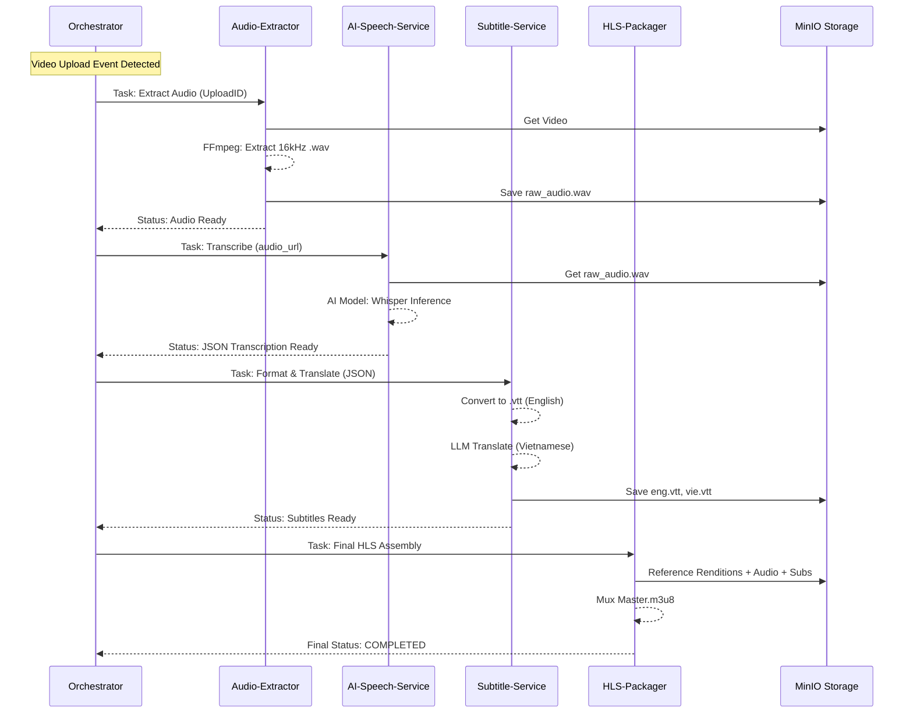
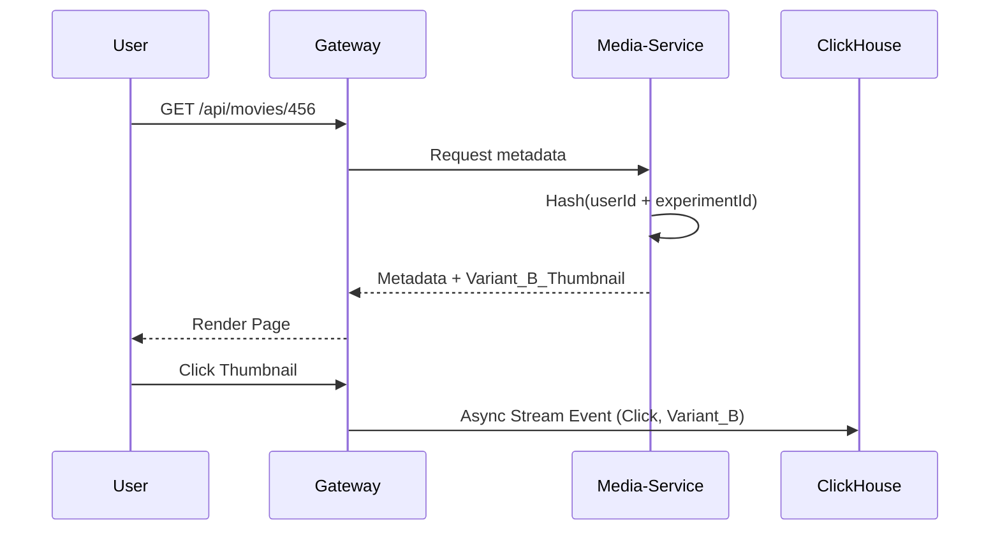
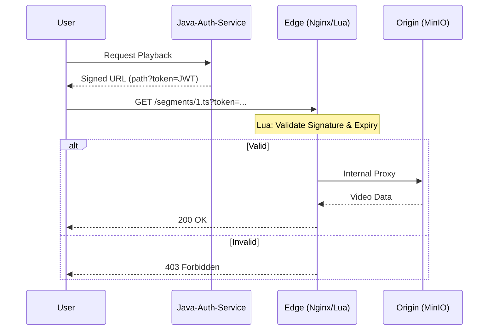

# Advanced Features Deep Dive: Netflix-Scale Architecture

This document provides a deep-dive into the implementation of the three "Big Tech" features for the BBMovie platform.

---

## 1. Media Processing Depth: Multi-Track HLS, DRM & AI Subtitles

### 1.1 Microservices Decomposition
Instead of a monolithic worker, we decompose media processing into specialized services to scale compute-intensive tasks independently.

| Service | Responsibility | Core Tech |
| :--- | :--- | :--- |
| **Media-Orchestrator** | State machine & task coordination | Camunda / NATS |
| **Video-Transcoder** | Generating HLS video renditions (1080p, 720p, etc.) | FFmpeg (libx264) |
| **Audio-Extractor** | Stripping audio for AI processing (16kHz Mono) | FFmpeg |
| **AI-Speech-Service** | Speech-to-Text inference | Whisper (C++/Rust) |
| **Subtitle-Service** | WebVTT formatting & LLM Translation | Node/Java + LLM |
| **HLS-Packager** | Final Master Playlist (.m3u8) muxing | Shaka Packager / FFmpeg |

### 1.2 Automated AI Subtitle Pipeline Flow
This flow demonstrates how we generate subtitles from scratch for raw video uploads.



### 1.3 Implementation Details (Deep Dive)
**A. Optimized Audio Extraction:**
We extract a lightweight 16kHz mono WAV file to minimize bandwidth and optimize AI model performance.
```bash
ffmpeg -i input.mp4 -vn -acodec pcm_s16le -ar 16000 -ac 1 output.wav
```

**B. Multi-Track HLS Playlist Structure:**
The `HLS-Packager` generates a master playlist using `#EXT-X-MEDIA` tags to allow seamless track switching.
```m3u8
#EXT-X-MEDIA:TYPE=AUDIO,GROUP-ID="audio",NAME="English",DEFAULT=YES,URI="eng/playlist.m3u8"
#EXT-X-MEDIA:TYPE=SUBTITLES,GROUP-ID="subs",NAME="English",DEFAULT=YES,URI="subs/eng.m3u8"
#EXT-X-MEDIA:TYPE=SUBTITLES,GROUP-ID="subs",NAME="Vietnamese",DEFAULT=NO,URI="subs/vie.m3u8"

#EXT-X-STREAM-INF:BANDWIDTH=5000000,RESOLUTION=1920x1080,AUDIO="audio",SUBTITLES="subs"
1080p/playlist.m3u8
```

**C. DRM Strategy (ClearKey):**
We implement AES-128 encryption where the player must fetch a key from our `media-streaming-service`.
*   **Segment Encryption:** Every `.ts` file is encrypted with a unique key.
*   **Key Security:** The HLS playlist points to an internal URL: `#EXT-X-KEY:METHOD=AES-128,URI="https://api.bbmovie.com/v1/keys/123"`.
*   **Validation:** The Java service validates the user's JWT/Subscription before serving the 16-byte key.

### 1.4 Senior Engineer Rationale (War Stories)
*   **Cost Optimization:** By extracting a 16kHz WAV instead of processing the full 4K MP4 for AI, we reduce data transfer costs and inference time by ~80%.
*   **Scalability:** Decoupling the AI-Speech-Service allows it to be hosted on GPU-optimized instances, while the Transcoder can scale on CPU-heavy instances.
*   **Graceful Degradation:** If the AI service is overloaded, the system can publish the video first and add subtitles asynchronously later, ensuring the user experience isn't blocked by slow AI inference.

---

### 1.5 Infrastructure Efficiency: Avoiding Redundant Data Transfer
In a distributed microservices architecture, moving large 4K video files between services is the biggest bottleneck. We implement three strategies to ensure high performance and low storage costs.

#### A. The "Key-Exchange" Pattern (NATS + MinIO)
Services never send raw bytes to each other. They only exchange **Object Keys**.
*   **Workflow:** `Service A` writes to MinIO and publishes a message `{"fileKey": "uploads/raw_123.mp4"}`. `Service B` receives the key and pulls only what it needs.
*   **Result:** The heavy data stays in the high-speed Object Store (Origin); only lightweight metadata travels over the network.

#### B. Unix Pipe Streaming (Zero-Disk I/O)
To avoid filling up local SSDs, we use pipes to stream data directly through memory.
```bash
# Streaming from MinIO, through FFmpeg, directly back to MinIO
curl -s http://minio/bucket/video.mp4 | \
  ffmpeg -i pipe:0 -f hls -hls_time 10 pipe:1 | \
  aws s3 cp - s3://bucket/output/
```
*   **Rationale:** The file is processed as it is downloaded. It never occupies physical disk space on the worker node, reducing I/O wait times.

#### C. Chunk-Based Parallelism (Netflix "Split-and-Merge")
For massive files, we divide the work. A 2-hour movie is split into 24 chunks of 5 minutes each.
1.  **Splitter:** Performs a "Stream Copy" (no re-encoding) to create small chunks (Seconds).
2.  **Parallel Workers:** 24 instances of `Video-Transcoder` process one chunk each simultaneously.
3.  **Packager:** Concatenates the finished chunks into a single HLS Master Playlist.
*   **Result:** Transcoding time is reduced from hours to minutes by scaling horizontally.

---

## 2. Data-Driven Product: A/B Testing & Analytics

### 2.1 Architectural Flow
Ensuring a user sees the same variant (Consistency) without storing it in the DB (Scalability).



### 2.2 Implementation Details
**A. Deterministic Bucketing (Java):**
We use a MurmurHash or a simple string hash to ensure the user stays in the same bucket forever without a DB lookup.
```java
public String getThumbnailVariant(UUID userId, Movie movie) {
    String experimentId = "artwork_personalization_v1";
    long seed = (userId.toString() + experimentId).hashCode();
    Random random = new Random(seed);
    
    // 50/50 Split
    return random.nextBoolean() ? movie.getThumbnailA() : movie.getThumbnailB();
}
```

**B. Analytics Aggregation (ClickHouse):**
ClickHouse allows us to calculate CTR (Click-Through Rate) across millions of users instantly.
```sql
SELECT 
    variant,
    countIf(event_type = 'click') AS clicks,
    countIf(event_type = 'impression') AS views,
    clicks / views AS ctr
FROM movie_events
WHERE experiment_id = 'artwork_personalization_v1'
GROUP BY variant
ORDER BY ctr DESC;
```

---

## 3. Global Scale: Edge Authentication (OpenResty/Lua)

### 3.1 Architectural Flow
Validating thousands of segment requests per second at the "Edge" to protect the "Origin" (MinIO).



### 3.2 Implementation Details
**A. The Lua Script (OpenResty):**
This code runs inside Nginx. It is highly optimized and prevents unauthorized access before the request even hits your app logic.
```lua
local jwt = require "resty.jwt"
local secret = "your-shared-secret"

local token = ngx.var.arg_token
if not token then
    ngx.exit(ngx.HTTP_FORBIDDEN)
end

local jwt_obj = jwt:verify(secret, token)
if not jwt_obj.verified then
    ngx.log(ngx.ERR, "Invalid token: ", jwt_obj.reason)
    ngx.exit(ngx.HTTP_FORBIDDEN)
end

-- If verified, Nginx continues to the 'proxy_pass' (MinIO)
```

**B. Rationale:**
By moving auth to the Edge, your Java microservices are freed from the overhead of checking tokens for every single video segment (HLS requests a new segment every 2-10 seconds). This architecture allows the platform to handle 100x more concurrent viewers.
