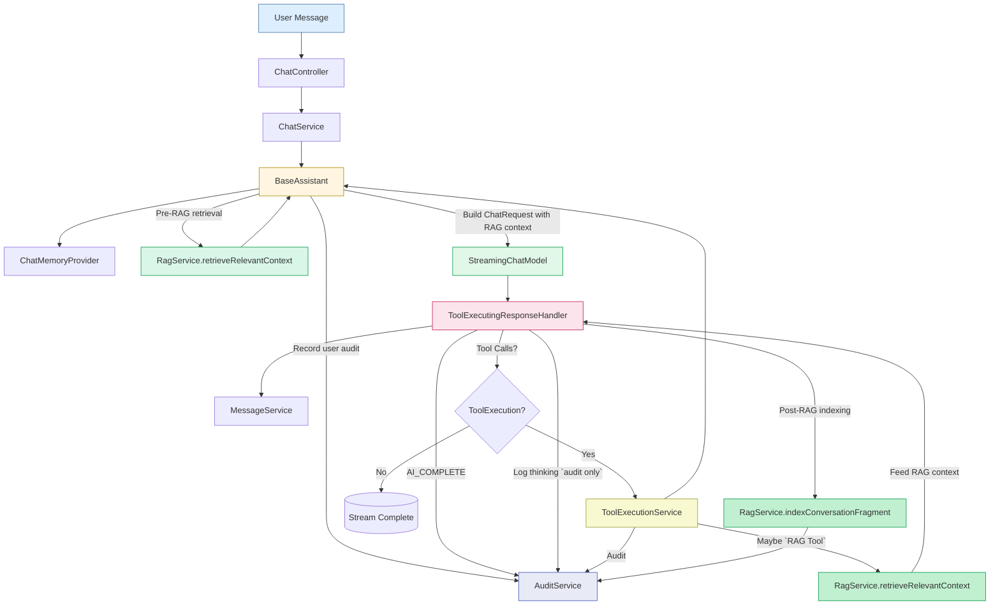

# Chat Orchestration Flow (RAG-Ready)

This document explains the orchestration pipeline of the AI chat system and how to integrate **RAG (Retrieval-Augmented Generation)** — both as a **pre-context retriever** and as a **tool**.

+ 1️⃣ User sends message
+ 2️⃣ Retrieve relevant contexts via RAG (movies + chat)
+ 3️⃣ Inject them into system prompt or user message
+ 4️⃣ Save the message + context to DB
+ 5️⃣ Proceed with chat model orchestration (tool-aware)
+ 6️⃣ Audit every major step
+ 7️⃣ Log AI thinking for audit (sanitized, never sent to clients)

## Response Stream Structure

Responses are streamed as `_ChatStreamChunk` objects with the following fields:
- **`type`**: Chunk type (`"assistant"`, `"rag_result"`, etc.)
- **`content`**: Streamed text content (token-by-token)
- **`thinking`**: AI reasoning (audit/logging only, **not sent to clients**)
- **`ragResults`**: RAG-retrieved movies (emitted last when RAG is used)

**Note:** The `thinking` field is always sanitized and logged for audit purposes but is never included in client responses.

