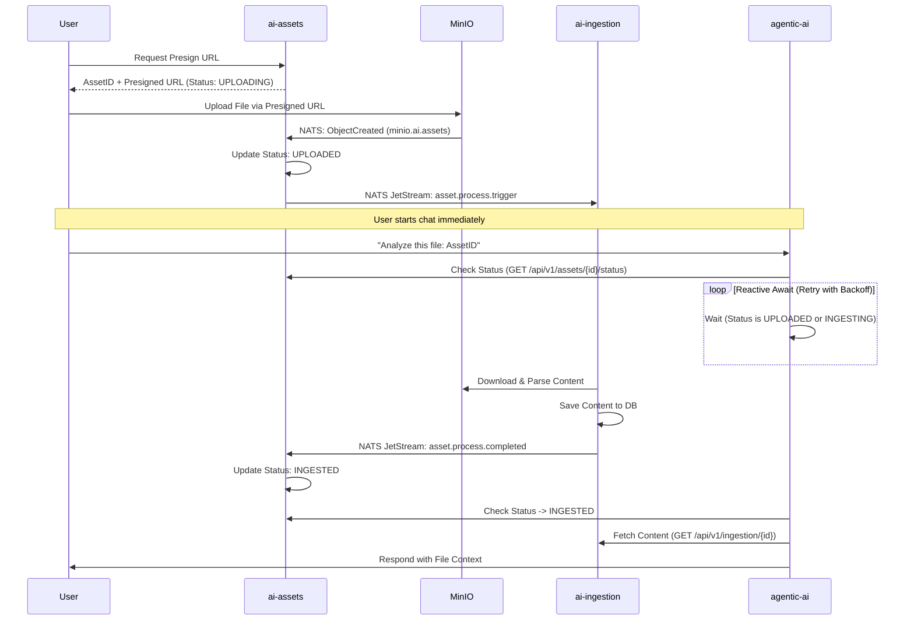

# Architecture: Distributed AI Asset Ingestion

This document outlines the high-performance, asynchronous pipeline for handling file uploads and ingestion within the AI Platform.

## 1. System Components

| Service | Responsibility | State Transitions |
| :--- | :--- | :--- |
| **`ai-assets`** | Presigned URLs, MinIO Event Handling, Metadata SOT | `UPLOADING` -> `UPLOADED` -> `INGESTED` |
| **`ai-ingestion`** | Heavy processing (Tika, PDF, OCR), Content extraction | `INGESTING` |
| **`agentic-ai`** | Chat orchestration, Reactive status awaiting | `USED` / `SAVED` |

## 2. Distributed Async-Await Flow (The "Flex")

To handle the race condition where a user chats with an `assetId` before ingestion is complete, we implement a **Reactive Awaiter** in `agentic-ai`.

## 3. MinIO Event Isolation

To avoid conflicts with video processing or other storage events:
1. **Bucket Scoping**: Dedicated bucket `ai-platform-assets`.
2. **NATS Subject Scoping**: MinIO configured to publish strictly to `minio.ai.assets.*`.
3. **Event Filtering**: Listeners will validate `contentType` (e.g., `application/pdf`, `text/markdown`) before triggering the ingestion pipeline.

## 4. State Machine (ai-assets)

| Status | Trigger | Description |
| :--- | :--- | :--- |
| `UPLOADING` | User requests presign | DB record created, waiting for MinIO. |
| `UPLOADED` | MinIO NATS Event | Physical file exists in storage. |
| `INGESTING` | Ingestion Service start | File is being parsed by Tika/Spring AI. |
| `INGESTED` | Ingestion Service finish | Content is indexed and ready for AI context. |
| `USED` | Chat Service success | Asset has been successfully injected into a prompt. |

## 5. Technology Stack
- **Ingestion**: Spring AI (Tika, PDF, Markdown Readers).
- **Communication**: NATS JetStream (Async), WebClient (Sync status check).
- **Storage**: MinIO (Blob), PostgreSQL/R2DBC (Metadata/Content).
