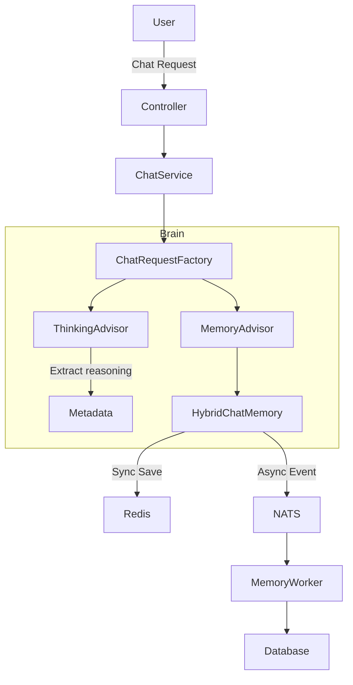

# Agentic AI Service

This service is the brain of the AI Platform, responsible for orchestrating LLM interactions, managing conversation state, and executing agentic tools.

## Core Features

### 1. Intelligent Chat Orchestration
Managed by `ChatRequestFactory`, the system builds complex `ChatClient` requests that include:
- **Personalization**: User-specific context (preferences, style) retrieved via `PersonalizationService`.
- **Content Refining**: Automated extraction of relevant data from attached files/assets via `ContentRoutingService`.
- **Model Routing**: Dynamic selection of the best model (Ollama, Gemini, OpenAI) for the task.

### 2. Reasoning Extraction (Thinking)
The `ThinkingAdvisor` automatically intercepts reasoning traces (e.g., from DeepSeek-R1 or Qwen) wrapped in `<think>` tags.
- It moves the thinking process into message metadata.
- It cleans the final output for a better user experience.
- The reasoning process is persisted separately in the database for future auditing.

### 3. Hybrid Memory Architecture
The system uses a high-performance, two-layer memory strategy implemented in `HybridChatMemory`:
- **L1 (Short-term)**: Redis-based caching for immediate retrieval.
- **L2 (Long-term)**: NATS-based asynchronous event processing for reliable database persistence without blocking the chat thread.

### 4. Tool & MCP Integration
The `ToolManager` dynamically aggregates capabilities from:
- **Local Tools**: Spring AI `@Tool` annotated methods.
- **MCP (Model Context Protocol)**: Seamless integration with external MCP servers for extended capabilities (Search, Code Analysis, etc.).

## Technical Stack
- **Spring AI**: 2.0.0-M5
- **Project Reactor**: For non-blocking, reactive streams.
- **NATS JetStream**: For asynchronous event sourcing.
- **Redis**: For high-speed session memory.
- **Postgres (R2DBC)**: For persistent message storage.

## Architecture Diagram

