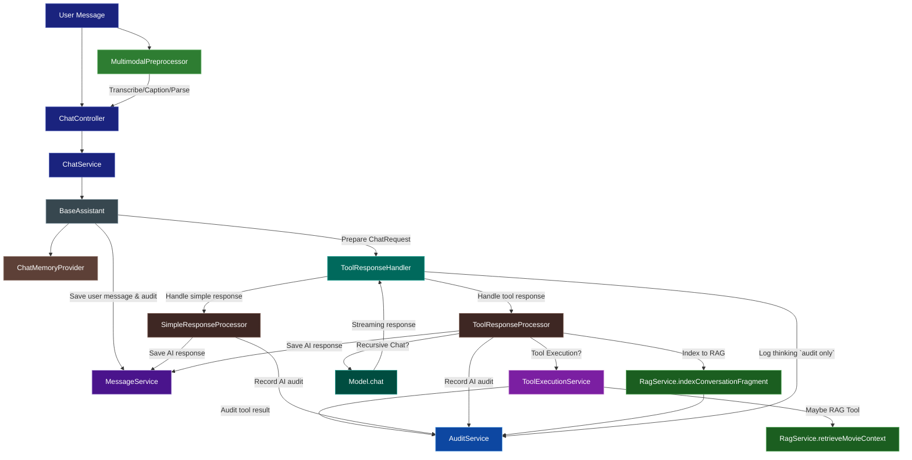

# Chat Orchestration Flow

This document explains the orchestration pipeline of the AI chat system, including both RAG-enabled and simple chat flows.

## High-Level Architecture

The chat system follows this flow for all interactions:

1. **User sends message** (optionally with multimodal attachments) to the chat endpoint
2. **Message is saved** and **audit record created** for user message
3. **Chat request is prepared** with system prompt and conversation history
4. **Streaming response handler is created** based on assistant type
5. **Model processes** the request and may call tools
6. **Tool execution** (if needed) with potential RAG calls
7. **Response is streamed** token-by-token back to client
8. **Post-processing** including indexing to RAG if applicable and audit completion

## Response Stream Structure

Responses are streamed as `ChatStreamChunk` objects with the following fields:
- **`type`**: Chunk type (`"assistant"`, `"user"`, `"tool"`, `"system"`, `"rag_result"`)
- **`content`**: The actual text content (streamed token-by-token for assistant responses)
- **`thinking`**: AI's reasoning process (for audit/logging only, **never sent to clients**)
- **`metadata`**: Optional metadata map
- **`ragResults`**: Optional list of RAG-retrieved movies (emitted last when RAG is used)

### Thinking Field

The `thinking` field contains the AI's reasoning trace (when using models with thinking capability like Ollama's thinking models).

**Important Notes:**
- Thinking is **always logged** for audit purposes (sanitized to remove sensitive information)
- Thinking is **never sent to clients** in the stream
- Thinking is sanitized in `BaseResponseHandler` to remove:
  - Session IDs (UUIDs)
  - Internal tool names and parameters
  - System implementation details

The thinking is logged at `TRACE` level with the prefix `[thinking][audit]` for debugging and compliance purposes.

## Multimodal Entry Point

Attachments (audio, images, files) are optional but can travel with any user message. The `MultimodalPreprocessor` handles validation, transcription/captioning, and parsing before the message flows through the existing assistant pipeline. Derived text is appended to the originating user turn so the downstream handlers remain unchanged. See `docs/multimodal-chat.md` for payload details and modality-specific behavior.

## Handler Architecture

Different assistants use different handler factories:

- **UserAssistant** → `userHandlerFactory` → `ToolResponseHandler` with `ToolResponseProcessor`
- **AdminAssistant** → `adminHandlerFactory` → `ToolResponseHandler` with `ToolResponseProcessor`
- **ModAssistant** → `modHandlerFactory` → `ToolResponseHandler` with `ToolResponseProcessor`
- **AnonymousAssistant** → `simpleHandlerFactory` → `ToolResponseHandler` with `SimpleResponseProcessor`

The `ToolResponseHandler` uses `ResponseProcessor` implementations to handle either simple responses or tool-executing responses.

