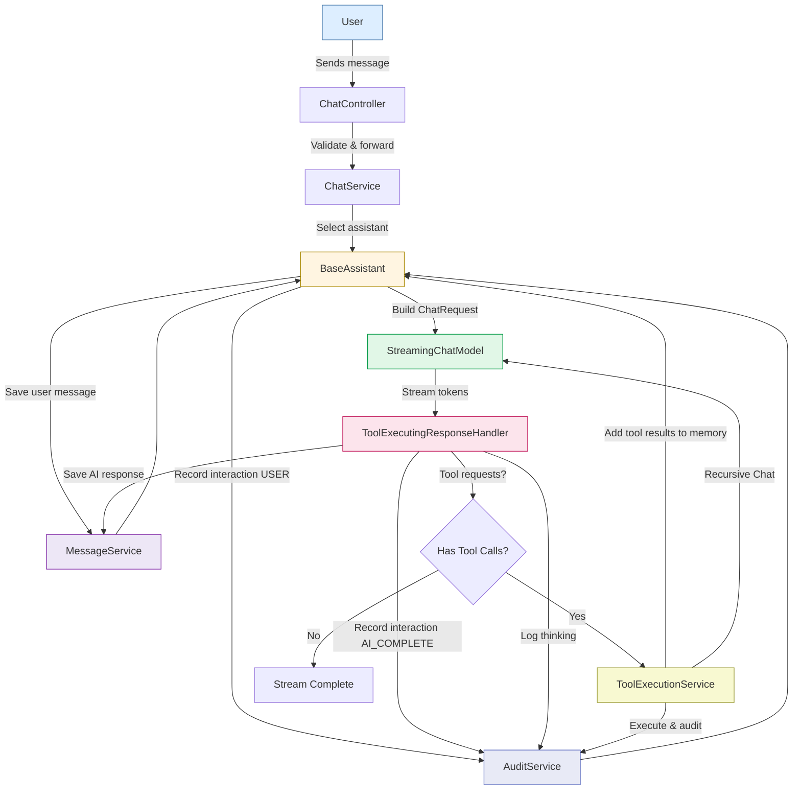

# Chat Orchestration Flow (Without RAG)

This document explains the orchestration pipeline of the AI chat system and how to integrate **RAG (Retrieval-Augmented Generation)** — both as a **pre-context retriever** and as a **tool**.

---

## Response Structure

The chat system streams responses as `_ChatStreamChunk` objects with the following structure:

- **`type`**: The type of chunk (`"assistant"`, `"user"`, `"tool"`, `"system"`, `"rag_result"`)
- **`content`**: The actual text content (streamed token-by-token for assistant responses)
- **`thinking`**: AI's reasoning process (for audit/logging only, **never sent to clients**)
- **`metadata`**: Optional metadata map
- **`ragResults`**: Optional list of RAG-retrieved movies (emitted last when RAG is used)

### Thinking Field

The `thinking` field contains the AI's reasoning trace (when using models with thinking capability like Ollama's thinking models). 

**Important Notes:**
- Thinking is **always logged** for audit purposes (sanitized to remove sensitive information)
- Thinking is **never sent to clients** in the stream
- Thinking is sanitized using `_ThinkingSanitizer` to remove:
  - Session IDs (UUIDs)
  - Internal tool names and parameters
  - System implementation details

The thinking is logged at `TRACE` level with the prefix `[thinking][audit]` for debugging and compliance purposes.

---

##  High-Level Architecture

