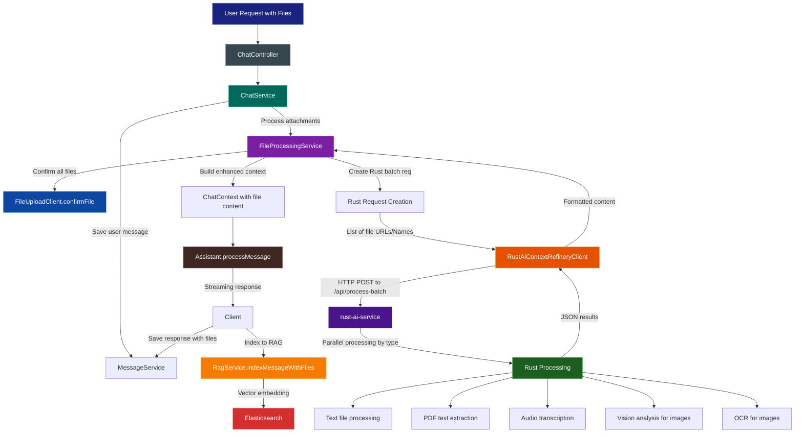

# Enhanced File Processing Flow with Rust AI Service Integration

This document explains the enhanced file processing pipeline that integrates the AI chat system with specialized Rust AI service for efficient file processing, including images, audio, PDFs, and other supported file types.

## Overview

The enhanced file processing system now supports multimodal chat by:
1. Accepting file uploads via multipart/form-data to file-service
2. Processing files via Rust AI Context Refinery service for specialized tasks (OCR, transcription, text extraction)
3. Including processed content in the chat context for the AI assistant
4. Storing processed content in Elasticsearch vector database for RAG

## Supported File Types

| Type | Extensions | Processing | Output |
|------|------------|------------|--------|
| **Images** | jpg, jpeg, png | Rust OCR/vision analysis via file URLs | File reference + OCR text + Vision description |
| **Audio** | mp3, wav, m4a | Rust Whisper transcription via file URLs | File reference + transcription text |
| **PDF** | pdf | Rust PDF text extraction via file URLs | File reference + extracted text |
| **Text** | txt, md, json, xml, csv | Rust text file processing via file URLs | File reference + file content |

## Architecture

### Component Diagram

```
┌─────────────────────────────────────────────────────────────────────────┐
│                           ChatController                                 │
│  - Handles HTTP multipart requests with file attachments                │
│  - Delegates business logic to ChatService                              │
└────────────────────────────────┬────────────────────────────────────────┘
                                 │
                                 ▼
┌─────────────────────────────────────────────────────────────────────────┐
│                            ChatService                                   │
│  - Orchestrates file processing + chat                                   │
│  - Processes ChatRequestDto with file attachments                        │
│  - Builds enhanced chat context with file references & extracted content │
└────────────────────────────────┬────────────────────────────────────────┘
                                 │
                                 ▼
┌─────────────────────────────────────────────────────────────────────────┐
│                       FileProcessingService                              │
│  - Processes file attachments from request DTO                           │
│  - Confirms files with file-service                                      │
│  - Prepares batch requests for Rust AI service                           │
│  - Processes Rust service responses and formats content                  │
└────────────────────────────────┬────────────────────────────────────────┘
                                 │
                                 ▼
┌─────────────────────────────────────────────────────────────────────────┐
│                   RustAiContextRefineryClient                            │
│  - Makes HTTP calls to Rust AI service                                   │
│  - Processes batch responses from /api/process-batch endpoint            │
│  - Maps responses to extracted content                                   │
└────────────────────────────────┬────────────────────────────────────────┘
                                 │
        ┌────────────────────────┼────────────────────────┐
        ▼                        ▼                        ▼
┌───────────────┐    ┌───────────────────┐    ┌───────────────────┐
│ file-service  │    │ rust-ai-service   │    │ ai-service        │
│(microservice) │    │ (microservice)    │    │ (microservice)    │
│               │    │                   │    │                   │
│ Receives &    │    │ - OCR & Vision    │    │ - Chat orchestration│
│ stores files  │    │ - Audio transcription│   │ - RAG integration │
│ via /internal │    │ - PDF text extraction│   │ - Tool execution  │
│ /files/upload │    │ - Text processing   │    │ - Response streaming│
└───────┬───────┘    └───────────────────┘    └───────────────────┘
        │                       │                           │
        └───────────────────────┼───────────────────────────┘
                                │
                       ┌───────────────────┐
                       │    Elasticsearch  │
                       │ (Vector database) │
                       │                   │
                       │ Stores processed  │
                       │ content for RAG   │
                       └───────────────────┘
```

### Flow Diagram



## Detailed Flow

### 1. File Upload and Storage

```
Client Upload → InternalFileController → InternalFileService.uploadGeneralFiles() 
              → FileValidationService → LocalStorageStrategyImpl.store()
              → FileAsset record in database → Return file metadata
```

### 2. Chat Request Processing

```
ChatController → ChatService → FileProcessingService
               → FileUploadClient.confirmFile() for each file
               → Prepare RustProcessRequest batch
               → RustAiContextRefineryClient.processBatch()
               → Format extracted content
               → Build ChatContext with file info
```

### 3. Rust Service Integration

```
RustAiContextRefineryClient → HTTP POST to /api/process-batch
                            → Rust service downloads files from file-service URLs
                            → Parallel processing by file type
                            → Return JSON results
                            → Format results for LLM context
```

### 4. Content Integration and RAG

```
Enhanced Chat Context → LLM Processing → Streaming Response
                    → MessageService.saveAiResponseWithFileContentInfo()
                    → RagService.indexMessageWithFiles()
                    → Elasticsearch vector storage
```

## Key Endpoints

### File Service
- **POST `/internal/files/upload`** - Upload and store files, create FileAsset records
- **GET `/internal/files/{filename}`** - Download temp files by filename
- **GET `/internal/files/download/{id}`** - Download permanent files by ID

### AI Service
- **POST `/api/v1/chat/{sessionId}`** - Process chat with file references in request body

### Rust AI Service
- **POST `/api/process-batch`** - Batch process multiple files with different types
- **GET `/health`** - Health check endpoint

## Data Flow

### 1. File Metadata Flow
```
FilePart → InternalFileController → InternalFileService → FileValidationService → LocalStorageStrategy → FileAsset in DB
```

### 2. Processing Request Flow
```
ChatRequestDto.attachments → FileProcessingService → RustProcessRequest list → RustAiContextRefineryClient → HTTP call to Rust → JSON response
```

### 3. Content Formatting
```
Rust results → FileProcessingService.extractResultText() → ProcessedFileContent → ChatContext.extractedFileContent
```

```
=== File: image.png ===
Type: image
Content:
OCR: [Extracted text from image]
Vision: [Visual description of image]

=== File: audio.mp3 ===
Type: audio
Content:
[Transcribed audio text here...]

=== File: document.pdf ===
Type: pdf
Content:
[Extracted PDF text content here...]
```

## Key Classes & Services

| Component                     | Responsibility                                            |
|-------------------------------|-----------------------------------------------------------|
| `InternalFileController`      | File upload/download endpoints in file-service            |
| `InternalFileService`         | Core file upload, storage, and retrieval logic            |
| `FileProcessingService`       | Coordinates with Rust service for file processing         |
| `RustAiContextRefineryClient` | HTTP client for Rust AI service communication             |
| `FileValidationService`       | Tika-based file validation in file-service                |
| `ChatService`                 | Orchestrates full chat flow with file processing          |
| `RagService`                  | Stores processed content to Elasticsearch vector database |

## Service Communication

### file-service ↔ rust-ai-service
- **Communication**: HTTP REST calls
- **Protocol**: JSON over HTTP
- **Data Format**: File URLs for download, JSON for processing results
- **Authentication**: Service discovery via Eureka (no explicit auth currently)

### ai-service ↔ file-service
- **Communication**: HTTP REST calls via FileUploadClient
- **Protocol**: JSON over HTTP  
- **Data Format**: File metadata and confirmation requests

### ai-service ↔ rust-ai-service
- **Communication**: HTTP REST calls via RustAiContextRefineryClient
- **Protocol**: JSON over HTTP
- **Data Format**: Batch processing requests and responses

## Configuration Properties

### AI Service
```properties
# Rust AI service configuration
rust.ai.service.enabled=true
rust.ai.service.url=lb://AI-REFINERY  # Service discovery via Eureka
```

### File Service
```properties
# Upload directories
spring.upload-dir=${UPLOAD_DIR}
app.upload.temp-dir=${TEMP_PATH}
```

## Error Handling

- **Rust service unavailable**: Gracefully handled, returns empty content but continues processing
- **File validation failures**: Prevent upload and return error to client
- **File download failures**: Rust service handles gracefully, returns error in response
- **Authentication errors**: Propagated to client with appropriate HTTP status

## Performance Considerations

- **Batch Processing**: Multiple files processed in single Rust request to minimize network overhead
- **Parallel Processing**: Rust service handles different file types concurrently
- **Temporary File Cleanup**: Automatic cleanup after processing in file-service
- **Service Scaling**: All services designed for horizontal scaling

## Future Enhancements

1. **Enhanced Error Recovery**: Retry mechanisms for transient failures
2. **File Caching**: Cache processed results to avoid reprocessing
3. **Progress Tracking**: Streaming progress updates for large file processing
4. **Advanced RAG**: More sophisticated content chunking and retrieval strategies