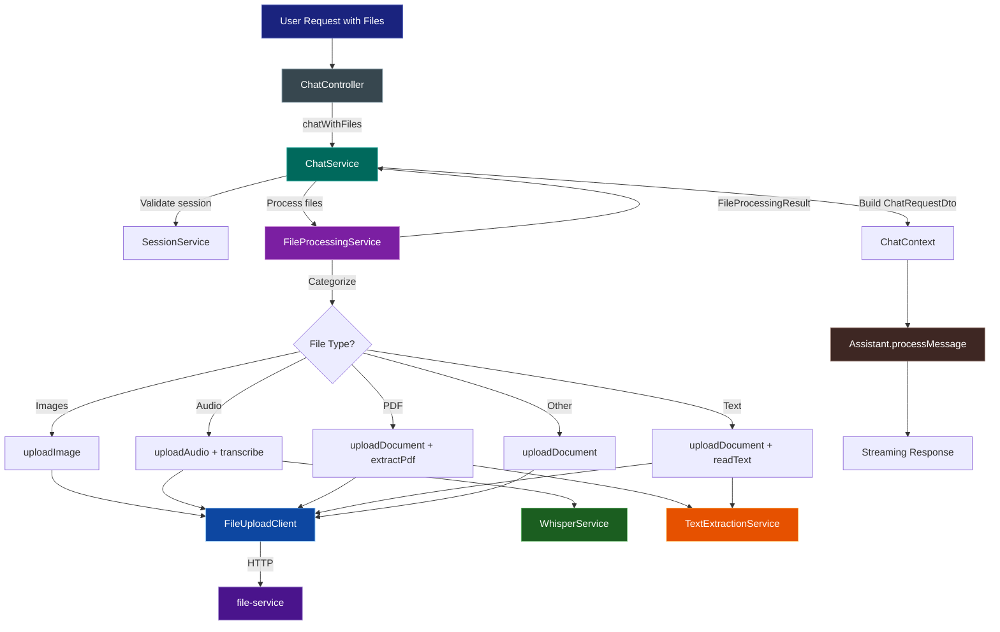

# File Processing Flow

This document explains the file processing pipeline for the AI chat system, which enables users to upload files (images, audio, PDFs, text files) alongside their chat messages.

## Overview

The file processing system supports multimodal chat by:
1. Accepting file uploads via multipart/form-data
2. Processing files based on their type (upload, transcribe, extract text)
3. Including processed content in the chat context for the AI assistant

## Supported File Types

| Type | Extensions | Processing | Output |
|------|------------|------------|--------|
| **Images** | jpg, jpeg, png | Upload + OCR/vision analysis | File reference + textual summary |
| **Audio** | mp3, wav, ogg, m4a, flac, aac, wma | Upload + Whisper transcription | File reference + transcription text |
| **PDF** | pdf | Upload + PDFBox text extraction | File reference + extracted text |
| **Text** | txt, md, json, xml, csv, yaml, yml, html, css, js, java, py, sql | Upload + direct read | File reference + file content |
| **Word** | doc, docx, odt, rtf | Upload only (extraction TBD) | File reference |

## Architecture

### Component Diagram

```
┌─────────────────────────────────────────────────────────────────────────┐
│                           ChatController                                 │
│  - Thin controller, only handles HTTP concerns                          │
│  - Delegates all business logic to ChatService                          │
└────────────────────────────────┬────────────────────────────────────────┘
                                 │
                                 ▼
┌─────────────────────────────────────────────────────────────────────────┐
│                            ChatService                                   │
│  - chatWithFiles(): Orchestrates file processing + chat                 │
│  - chat(): Handles text-only requests                                   │
│  - Builds ChatRequestDto with file references and extracted content     │
└────────────────────────────────┬────────────────────────────────────────┘
                                 │
                                 ▼
┌─────────────────────────────────────────────────────────────────────────┐
│                       FileProcessingService                              │
│  - Categorizes files by type                                            │
│  - Orchestrates parallel processing                                     │
│  - Returns FileProcessingResult                                         │
└────────────────────────────────┬────────────────────────────────────────┘
                                 │
        ┌────────────────────────┼────────────────────────┐
        ▼                        ▼                        ▼
┌───────────────┐    ┌───────────────────┐    ┌───────────────────┐
│FileUploadClient│    │TextExtractionSvc  │    │  WhisperService   │
│               │    │                   │    │                   │
│ - uploadImage │    │ - extractFromPdf  │    │ - transcribe      │
│ - uploadDoc   │    │ - readTextFile    │    │   (audio → text)  │
│ - uploadAudio │    │ - extractFromWord │    │                   │
└───────┬───────┘    └───────────────────┘    └───────────────────┘
        │
        ▼
┌───────────────┐
│ file-service  │
│ (microservice)│
│               │
│ Persists files│
│ to storage    │
└───────────────┘
```

Additional components:

- **DocumentProcessorService** – performs OCR + vision description for jpg/png files via `TesseractOCRService` and `VisionModelService`.
- **TextExtractionService** – handles textual document extraction (PDF/text/Word).
- **WhisperService** – transcribes audio attachments.

### Flow Diagram



*Images* additionally flow through the **DocumentProcessorService**, which combines Tesseract OCR and the vision model to produce textual summaries before feeding results back into `FileProcessingService`.

## API Endpoints

### POST /api/v1/chat/{sessionId}/files

Multipart request for chat with file attachments.

**Request:**
```
Content-Type: multipart/form-data

Parts:
- message (required): User's text message
- assistantType (required): "user", "admin", or "mod"
- aiMode (required): "FAST", "NORMAL", or "DEEP"
- files (optional): One or more files to process
```

**Example cURL:**
```bash
curl -X POST "http://localhost:8888/api/v1/chat/{sessionId}/files" \
  -H "Authorization: Bearer <token>" \
  -F "message=What's in this document?" \
  -F "assistantType=user" \
  -F "aiMode=NORMAL" \
  -F "files=@document.pdf" \
  -F "files=@audio.mp3"
```

### POST /api/v1/chat/{sessionId}

JSON request for text-only chat (backward compatible).

**Request:**
```json
{
  "message": "Hello, how are you?",
  "assistantType": "user",
  "aiMode": "NORMAL"
}
```

## Data Flow

### 1. File Categorization

Files are categorized based on content type and extension:

```
FileCategories {
    images: [jpg, jpeg, png]
    pdfs: [pdf]
    textFiles: [txt, md, json, xml, csv, yaml, ...]
    audio: [mp3, wav, ogg, m4a, flac, ...]
    otherDocs: [doc, docx, unknown types]
}
```

### 2. Parallel Processing

Files in each category are processed in parallel:

```
┌─────────────┐     ┌─────────────┐     ┌─────────────┐     ┌─────────────┐
│   Images    │     │    PDFs     │     │   Text      │     │    Audio     │
│(upload+OCR) │     │(upload+ext) │     │(upload+read)│     │(upload+ASR)  │
└──────┬──────┘     └──────┬──────┘     └──────┬──────┘     └──────┬──────┘
       │                   │                   │                   │
       └───────────────────┼───────────────────┼───────────────────┘
                           │
                           ▼
                 FileProcessingResult {
                   uploadedFiles: [...]
                   processedFiles: [...]
                   fileReferences: [...]
                 }
```

### 3. Content Formatting

Processed file content is formatted for the LLM:

```
=== File: document.pdf ===
Type: pdf
Content:
[Extracted PDF text content here...]

=== File: voice_note.mp3 ===
Type: audio
Content:
[Transcribed audio text here...]
```

### 4. Chat Context

The formatted content is included in `ChatContext`:

```
ChatContext {
    sessionId: UUID
    message: "User's original message"
    aiMode: NORMAL
    userRole: "user"
    fileReferences: ["url1", "url2"]
    extractedFileContent: "[formatted content]"
}
```

## Key Classes

| Class                   | Responsibility                                   |
|-------------------------|--------------------------------------------------|
| `ChatController`        | HTTP endpoint handling, request/response mapping |
| `ChatService`           | Chat orchestration, file processing coordination |
| `FileProcessingService` | File categorization and parallel processing      |
| `FileUploadClient`      | Communication with file-service microservice     |
| `TextExtractionService` | PDF and text file content extraction             |
| `WhisperService`        | Audio transcription using Whisper model          |

## Configuration

### Application Properties

```properties
# File service URL (defaults to service discovery)
file-service.url=lb://bbmovie-upload-file

# Storage preference (LOCAL, S3, CLOUDINARY)
file-service.storage=LOCAL
```

### Limits

| Setting         | Value        | Description                             |
|-----------------|--------------|-----------------------------------------|
| Max file size   | 10 MB        | Per-file size limit for text extraction |
| Max text length | 50,000 chars | Truncation limit for extracted content  |

## Error Handling

- **File upload failures**: Logged but don't stop processing of other files
- **Transcription failures**: Returns empty transcription, continues processing
- **Extraction failures**: Returns error message in content, continues processing
- **Authentication errors**: Propagated to client with appropriate HTTP status

## Future Enhancements

1. **Word document extraction**: Implement Apache POI integration for .doc/.docx
2. **Image captioning**: Add vision model integration for image descriptions
3. **OCR support**: Extract text from images using Tesseract (already in dependencies)
4. **Streaming file upload**: Support for large file uploads with progress tracking
5. **File caching**: Cache extracted content to avoid reprocessing

