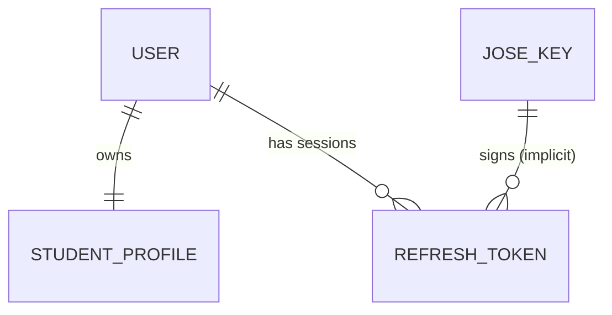

# Legacy Classes and Entities: auth-service

This document outlines the core data models and their relationships within the `auth-service` database schema.

## Core Entities

### 1. `User` (`users` table)
The central entity representing an identity on the platform.
- **Fields**:
  - `id` (UUID, Primary Key)
  - `email` (Unique, String)
  - `password` (Hashed, String)
  - `displayedUsername` (String)
  - `role` (Enum: `USER`, `MODERATOR`, `ADMIN`, `SUPER_ADMIN`)
  - `authProvider` (Enum: `LOCAL`, `GOOGLE`, `GITHUB`, etc.)
  - `isEnabled` (Boolean) - `true` after email verification.
  - `isMfaEnabled` (Boolean)
  - `totpSecret` (String) - Encrypted TOTP secret.
  - `referralCode` (Unique, String)
- **Relationships**:
  - `OneToOne` -> `StudentProfile` (via `student_profile_id` column).

### 2. `StudentProfile` (`student_profiles` table)
Stores verification data for the Student Program.
- **Fields**:
  - `id` (UUID, Primary Key)
  - `user` (JPA `OneToOne` mapping)
  - `student` (Boolean) - `true` if currently verified.
  - `studentVerificationStatus` (Enum: `PENDING`, `VERIFIED`, `REJECTED`, `NOT_STUDENT`)
  - `studentDocumentUrl` (String) - Link to uploaded ID document.
  - `studentStatusExpireAt` (LocalDateTime)

### 3. `JoseKey` (`jwk_keys` table)
Stores the RSA key pairs used for JWS signing.
- **Fields**:
  - `kid` (String) - Key ID.
  - `publicJwk` (TEXT) - Public key in JSON format.
  - `privateJwk` (TEXT) - Private key in JSON format.
  - `isActive` (Boolean) - Only one key is active for signing at a time.

### 4. `RefreshToken` (`refresh_token` table)
Used for stateful session management.
- **Fields**:
  - `sid` (Unique, String) - Session ID (referenced in Access Tokens).
  - `token` (String) - The actual signed Refresh Token.
  - `email` (String) - Associated user.
  - `deviceName`, `deviceOs`, `browser`, `deviceIpAddress` (Metadata)
  - `expiryDate` (Date)
  - `revoked` (Boolean)

## Entity Relationship Diagram (Conceptual)

## Security Component Classes

| Class | Responsibility |
| :--- | :--- |
| **`JoseProviderImpl`** | The core logic for signing/parsing JWTs and handling blacklists in Redis. |
| **`JoseAuthenticationFilter`** | Intercepts every request to validate the `Authorization` header against the `KeyCache`. |
| **`KeyRotation`** | Scheduled task that creates a new `JoseKey` every 7 days and deactivates old ones. |
| **`CustomUserDetailsService`** | Standard Spring Security bridge to fetch `User` entities from MySQL. |
| **`OAuth2LoginSuccessHandler`** | Logic to auto-register users who log in via Google/GitHub and issue their first JWT. |
