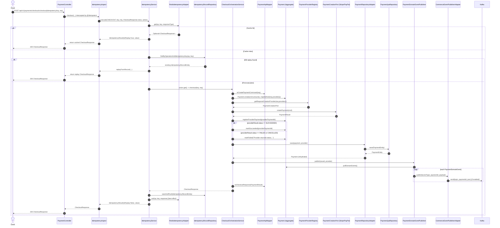
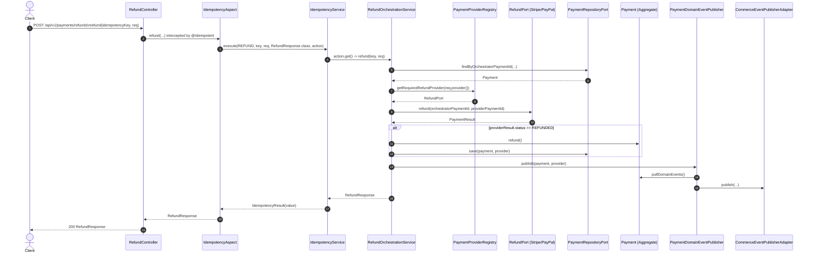
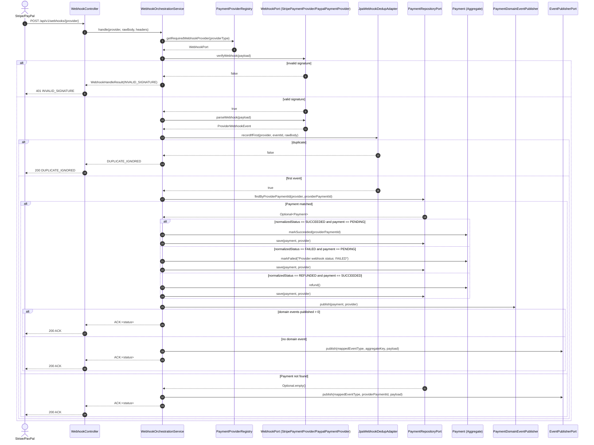
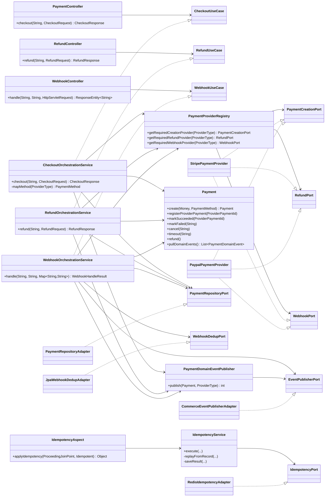
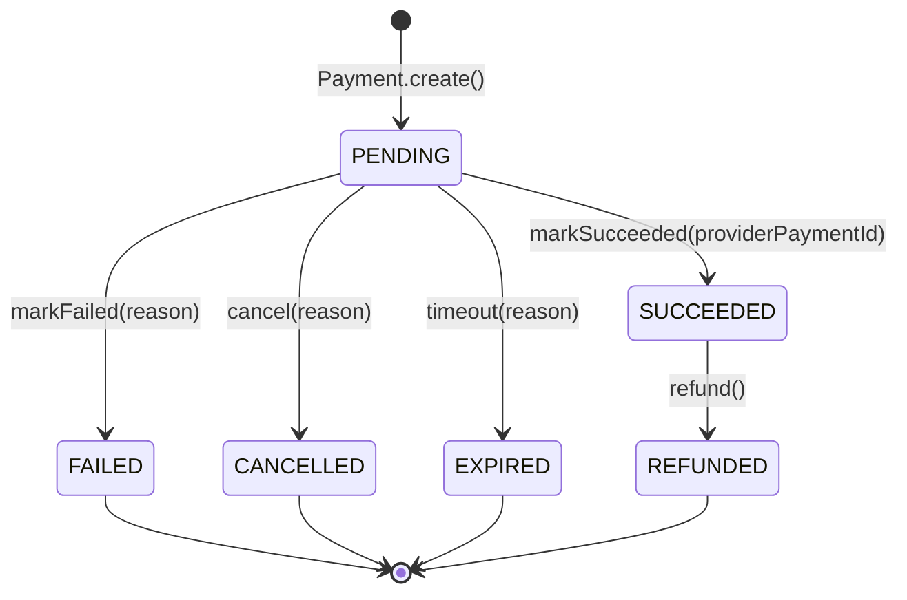

# Payment Orchestrator Transaction Flow Diagrams

This document visualizes how a transaction moves through the current codebase, including:

- Internal methods being called
- Class-to-class dependencies
- Port/adapter boundaries

## 1) Checkout Transaction Flow (with Idempotency AOP)

## 2) Refund Transaction Flow

## 3) Webhook Transaction Flow

## 4) Dependency Diagram (Classes and Ports)

## 5) Domain State Machine (Current Implementation)

