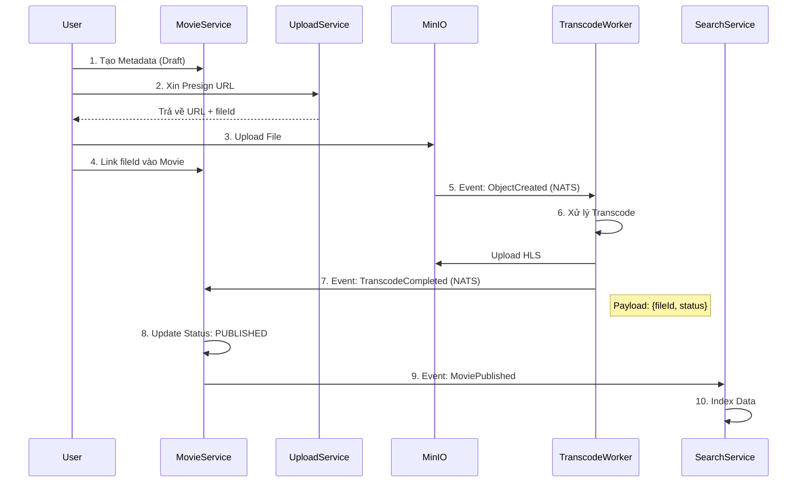

Luồng hiện tại của bác là **Event-Driven thuần kỹ thuật** (File vào -> Báo event -> Xử lý). Nó rất tốt, rất reactive.

Vấn đề duy nhất bây giờ là: **Làm sao để cái "Logic Phim" (Movie Service) biết được cái "File Vật Lý" kia đã xong để mà đem đi bán (Search/Stream)?**

Bác cần thực hiện **"Phép nối" (The Binding/Linking)** giữa Metadata và File.

Đây là kiến trúc đề xuất để nối luồng Movie và Search vào hệ thống hiện tại mà không phải đập đi xây lại luồng Upload:

---

### 🏛️ Kiến trúc tổng thể: "Bắt tay nhau qua Event"

Bác giữ nguyên luồng Upload/Transcode cũ. Chúng ta chỉ thêm các "Observer" (người nghe) vào NATS thôi.

### 🔄 Chi tiết luồng đi (Step-by-Step)

#### Giai đoạn 1: Chuẩn bị Metadata (Tại Movie Service)

1. **Admin:** Tạo phim mới (nhập tên, mô tả, diễn viên...).
2. **Movie Service:** Lưu DB với trạng thái `DRAFT`.
* `id`: `movie-101`
* `title`: "Đào, Phở và Piano"
* `file_id`: `NULL` (Chưa có file)

#### Giai đoạn 2: Upload & Link (Tại Client & Upload Service)

3. **Client:** Gọi `Upload Service` lấy Presign URL.
* **Upload Service:** Lưu `file_id: file-555`, `status: UPLOADING`. Trả về URL.

4. **Client:** Upload file lên MinIO.
5. **Client (QUAN TRỌNG):** Sau khi upload xong, Client gọi API về **Movie Service** để "Báo cáo":
* `PATCH /api/movies/movie-101` body `{ "file_id": "file-555" }`.
* **Movie Service:** Cập nhật DB: Link `movie-101` với `file-555`. Trạng thái chuyển sang `PROCESSING` (Chờ transcode).

#### Giai đoạn 3: Transcode & Xử lý ngầm (Luồng hiện tại của bác)

6. **MinIO:** Bắn event `ObjectCreated` vào NATS.
7. **Transcode Worker:**
* Nghe event -> Tải file về -> Transcode ra HLS (m3u8 + ts).
* Upload ngược lại MinIO folder `processed/`.
* 🚀 **Bắn Event:** `TranscodeCompletedEvent`.
* *Payload:* `{ file_id: "file-555", status: "SUCCESS", path: "/processed/..." }`.

#### Giai đoạn 4: Đồng bộ trạng thái (Phần bác đang thiếu)

8. **Upload Service:** Nghe `TranscodeCompletedEvent` -> Update status file thành `READY`.
9. **Movie Service:** **Cũng nghe `TranscodeCompletedEvent**`.
* Nó check DB: "À, cái `file-555` này đang gắn với `movie-101`".
* Update `movie-101`: `status = PUBLISHED`.
* 🚀 **Bắn Event:** `MoviePublishedEvent`.
* *Payload:* `{ movie_id: "movie-101", title: "...", file_path: "/processed/..." }`.

#### Giai đoạn 5: Indexing & Streaming

10. **Search Service:** Nghe `MoviePublishedEvent` -> Đẩy vào Elasticsearch/Meilisearch.
11. **Stream Service:**
* User gọi `GET /stream/movie-101`.
* Movie Service (hoặc Stream Service tự lookup) map `movie-101` -> `file-555` -> Lấy đường dẫn MinIO -> Trả về m3u8.

---

### 🛠️ Những điểm cần lưu ý kỹ thuật

#### 1. Vấn đề "Map ID" trong Event Transcode 🧩

Cái event từ MinIO bắn ra NATS thường chỉ có `bucket_name` và `object_key` (ví dụ: `raw/video_abc.mp4`). Nó **không có** `file_id` (UUID) của database bác.

**Giải pháp:**

* **Cách 1 (Dùng Metadata S3):** Lúc Client upload lên MinIO, bảo Client nhét thêm User Metadata `x-amz-meta-file-id: file-555`. MinIO sẽ bắn event kèm cái metadata này (tùy config). Transcode Worker đọc được và bắn event ra kèm `file_id`.
* **Cách 2 (Lookup ngược):**
* Transcode Worker nhận `object_key`.
* Trong `TranscodeCompletedEvent` gửi `object_key`.
* Upload/Movie Service dùng `object_key` để query DB tìm ra `file_id`.

#### 2. Xử lý Streaming (URL sạch) 🔗

Hiện tại Stream Service của bác đang lấy theo ID MinIO. Để user friendly hơn:

* Frontend gọi: `play_url = /api/stream/dao-pho-va-piano` (slug hoặc movie ID).
* Backend (Gateway/Movie Service): Resolve slug đó ra `file_path` thật trong MinIO (`processed/file-555/master.m3u8`) rồi redirect hoặc proxy.

#### 3. Flow cập nhật cho Search 🔎

Search Service chỉ nên nghe event từ **Movie Service**.

* Đừng nghe từ Transcode Worker. Vì Transcode xong chưa chắc Movie đã được publish (Admin muốn hẹn giờ đăng chẳng hạn).
* Chỉ khi Movie Service quyết định `PUBLISHED` thì Search mới được index.

### 📝 Tổng kết Diagram luồng dữ liệu

Bác chỉ cần thêm **Bước 4 (Client báo link file)** và **Bước 9 (Movie Service nghe event transcode)** là hệ thống kết nối hoàn chỉnh! 🚀