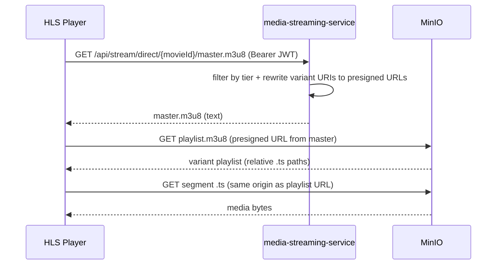

# Direct Media Stream (non-proxy)

Parallel to the legacy [proxy flow](./PROXY_MEDIA_STREAM.md). Tier filtering and authorization still run on `media-streaming-service`; **variant playlists, keys, and media segments are not streamed through Spring**. The client loads them from MinIO using **pre-signed GET URLs**.

## Endpoints (JWT required, same tier rules)

| Purpose | Method | Path | Response |
|--------|--------|------|----------|
| Master playlist | `GET` | `/api/stream/direct/{movieId}/master.m3u8` | Filtered `master.m3u8` body; each allowed variant line is rewritten to a **pre-signed URL** to `playlist.m3u8` on MinIO |
| Variant playlist | `GET` | `/api/stream/direct/{movieId}/{resolution}/playlist.m3u8` | **302 Found** → pre-signed MinIO URL |
| Encryption key | `GET` | `/api/stream/direct/keys/{movieId}/{resolution}/{keyFile}` | **302 Found** → pre-signed MinIO URL |

Legacy proxy routes under `/api/stream/...` (without `/direct`) are unchanged.

## Flow

## Configuration

| Property | Default | Meaning |
|----------|---------|--------|
| `streaming.direct.presigned-expiry-seconds` | `3600` | TTL for pre-signed GET URLs |

## Master playlist rewrite rules

After tier filtering, non-comment lines that match relative variant playlists

`{resolution}p/playlist.m3u8` (e.g. `720p/playlist.m3u8`)

are replaced by a pre-signed URL for object

`movies/{movieId}/{resolution}/playlist.m3u8`

in `minio.bucket.hls`.

Lines that are already absolute `http://` or `https://` are left unchanged.

If your packager uses different relative paths, extend `DirectMediaStreamService` (`RELATIVE_VARIANT_PLAYLIST`).

## CORS / browser playback

Pre-signed URLs point at the MinIO host. Ensure MinIO (or CDN in front) sends **CORS** headers that allow your web app origin for `GET` on playlists, segments, and keys.

## Operational notes

- **302 on variant/key**: one extra round-trip per request unless the player follows redirects (typical). Master stays a single authenticated fetch.
- **Expiry**: if a session plays longer than `presigned-expiry-seconds`, the client may need to refresh master or you increase TTL (trade-off with link sharing risk).
