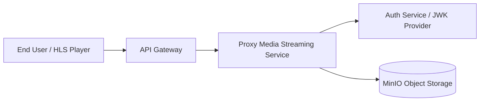
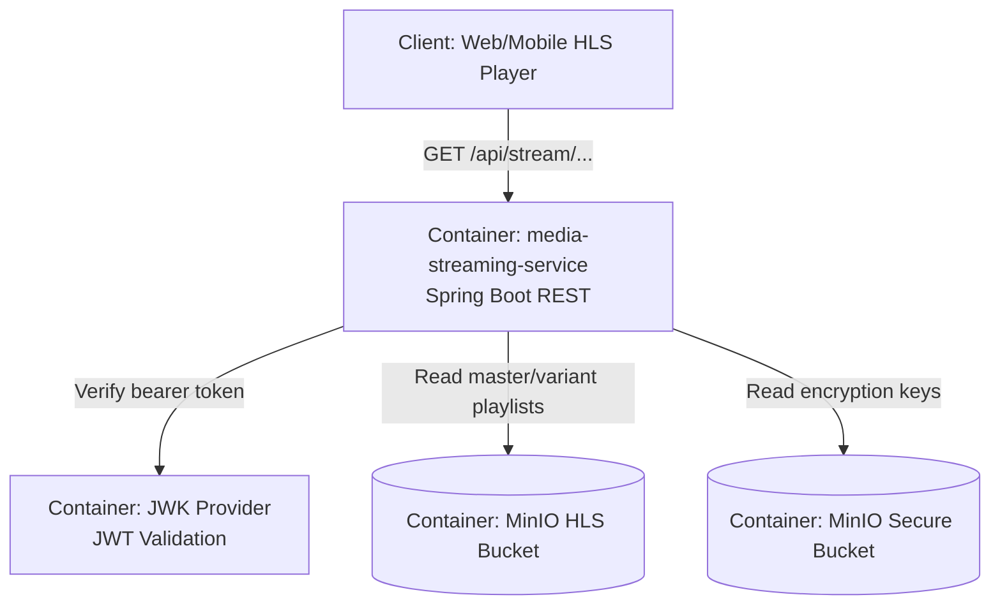
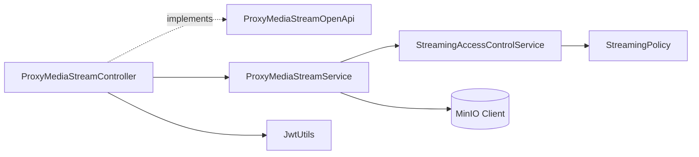

# Proxy Media Stream

This document describes the current proxy-stream design in `media-streaming-service`, including request flow and dependencies.

For a **parallel path without backend byte proxy** (pre-signed MinIO URLs), see [Direct Media Stream](./DIRECT_MEDIA_STREAM.md) (`/api/stream/direct/**`).

## Components

- `ProxyMediaStreamController`: HTTP entrypoint for HLS proxy logic under the stable public route `/api/stream`.
- `ProxyMediaStreamOpenApi`: OpenAPI + validation contract for controller methods.
- `ProxyMediaStreamService`: orchestration service for MinIO fetch and playlist/key serving.
- `StreamingAccessControlService`: tier-based filtering and authorization.
- `StreamingPolicy`: policy abstraction that maps subscription tiers to max allowed resolution.

## C4 Diagrams

### C4 Level 1 - System Context

### C4 Level 2 - Container View

### C4 Level 3 - Component View (inside media-streaming-service)

## Runtime Dependencies

- **Spring Boot Web + Security**
  - Receives HLS requests.
  - Extracts `Jwt` via resource server filter chain.
  - Applies method-level validation from `ProxyMediaStreamOpenApi`.
- **MinIO (`io.minio:minio`)**
  - Reads HLS playlists from `minio.bucket.hls`.
  - Reads encryption keys from `minio.bucket.secure`.
- **JWT/JWK provider**
  - Verifies bearer token and exposes user claims used by `JwtUtils.getUserTier(jwt)`.

## Request Flow

### 1) Master playlist

Endpoint: `GET /api/stream/{movieId}/master.m3u8`

1. `ProxyMediaStreamController.getMasterPlaylist(...)` receives `movieId` + `Jwt`.
2. Controller derives user tier from JWT.
3. `ProxyMediaStreamService.getFilteredMasterPlaylist(...)` loads original `master.m3u8` from MinIO.
4. `StreamingAccessControlService.filterMasterPlaylist(...)` removes variants above tier limit.
5. Service returns filtered bytes as `ByteArrayResource`.
6. Controller responds with content type `application/vnd.apple.mpegurl`.

### 2) Resolution playlist

Endpoint: `GET /api/stream/{movieId}/{resolution}/playlist.m3u8`

1. Controller receives requested resolution.
2. `ProxyMediaStreamService.getHlsFile(...)` checks tier access via `StreamingAccessControlService.checkAccessToResolution(...)`.
3. On success, service streams playlist from MinIO bucket `minio.bucket.hls`.
4. On denied resolution, throws `AccessDeniedException`.

### 3) Encryption key

Endpoint: `GET /api/stream/keys/{movieId}/{resolution}/{keyFile}`

1. Controller receives key request.
2. `ProxyMediaStreamService.getSecureKey(...)` runs the same tier access check.
3. Service streams key file from MinIO bucket `minio.bucket.secure`.
4. Controller responds as `application/octet-stream`.

## Validation Contract

Path constraints are defined in `ProxyMediaStreamOpenApi`:

- `resolution` must match `^(?:144|240|360|480|720|1080|1440|2160|4080)p$`
- `keyFile` must match `^key_\\d+\\.key$`

Keep constraints in the OpenAPI interface and avoid redefining them in controller implementation to prevent Bean Validation override conflicts (`HV000151`).

## Future Extension Points

- Replace static tier filtering with dynamic policy/ad insertion logic.
- Introduce per-session manifest stitching for SSAI.
- Add cache layer for filtered manifest responses to reduce MinIO roundtrips.
