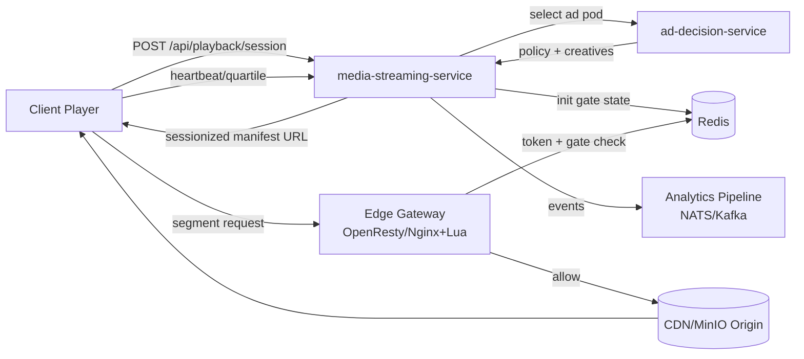
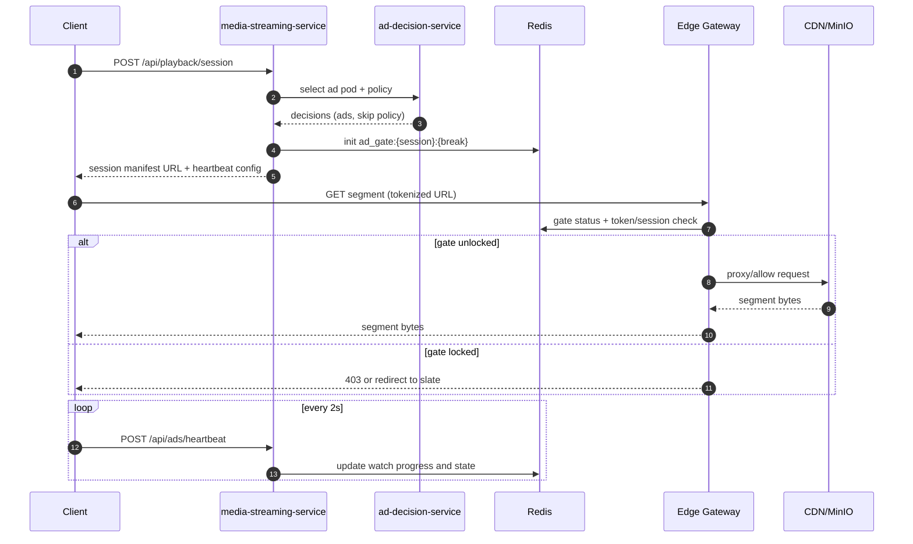
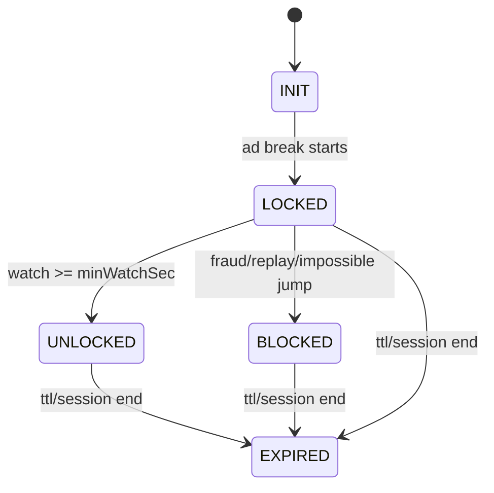
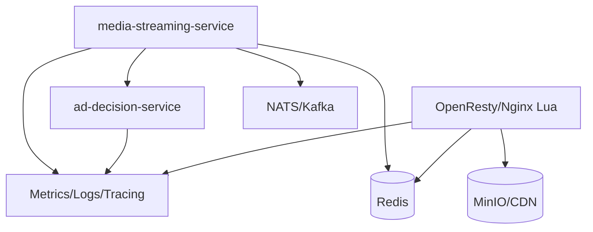

# SSAI Edge Gating Architecture (BBMovie)

> Status: Proposed  
> Owners: `media-streaming-service` + new `ad-decision-service`  
> Last updated: 2026-04-17

---

## 1) Why this design

Current streaming path proxies playlist/key delivery through backend. This is acceptable at small scale but becomes a bottleneck under concurrency and does not provide robust ad-skip enforcement.

This design targets:

- protocol-level ad enforcement (`min watch before skip`)
- scalable media delivery (direct CDN/MinIO fetch, no heavy media proxy in Spring)
- campaign flexibility (seasonal and personalized ad decisioning)
- production-grade anti-bypass architecture ("do not trust client")

---

## 2) High-level architecture

### System diagram



### Components

- `media-streaming-service`
  - playback session API
  - manifest sessionization / stitching coordinator
  - policy + gate orchestration
- `ad-decision-service` (new service)
  - campaign targeting and ad pod selection
  - skip policy selection by campaign/tier/context
- `Redis`
  - real-time gate state (`LOCKED`, `UNLOCKED`, fraud flags)
- `Edge Gateway` (OpenResty/Nginx+Lua or equivalent)
  - token validation
  - segment-level gate enforcement before origin
- `MinIO/CDN`
  - origin/object store and edge caching for segments
- `Analytics pipeline` (NATS/Kafka + downstream)
  - heartbeat, quartile, completion, fraud signals

### Architecture principle

- Backend does auth/business logic.
- Edge enforces segment access.
- Client provides UX and telemetry, but cannot be trusted as final authority.

---

## 3) End-to-end playback flow

### Sequence diagram



1. Client calls `POST /api/playback/session` with `movieId`, device metadata.
2. `media-streaming-service` authenticates user, resolves tier/profile.
3. `media-streaming-service` calls `ad-decision-service` with playback context.
4. `ad-decision-service` returns:
   - selected ad pod(s)
   - skip policy (`skipOffsetSec`, `minWatchSec`, `skippable`)
   - tracking identifiers
5. `media-streaming-service` generates sessionized manifest:
   - stitches ad breaks with HLS markers
   - issues tokenized segment URLs
   - initializes Redis gate state for ad breaks
6. Client starts playback:
   - sends heartbeat/quartile events
   - UI skip button can unlock after configured delay
7. Edge checks each segment request:
   - validates token signature/expiry/session binding
   - checks Redis gate state for break
   - `LOCKED` => deny/redirect to slate
   - `UNLOCKED` => allow content segment
8. On ad completion/session end:
   - emit completion analytics
   - clear gate/session state by TTL or explicit cleanup.

---

## 4) API contracts (initial draft)

### 4.1 Playback session

`POST /api/playback/session`

Request:

```json
{
  "movieId": "uuid",
  "deviceId": "string",
  "capabilities": ["hls"],
  "networkType": "wifi",
  "appVersion": "web-1.0.0"
}
```

Response:

```json
{
  "sessionId": "sess_xxx",
  "manifestUrl": "https://cdn.example.com/playback/sess_xxx/master.m3u8?...",
  "heartbeatIntervalMs": 2000,
  "adBreaks": [
    {
      "breakId": "break_001",
      "positionSec": 120,
      "durationSec": 30,
      "skippable": true,
      "skipOffsetSec": 10,
      "minWatchSec": 10
    }
  ]
}
```

### 4.2 Heartbeat

`POST /api/ads/heartbeat`

Request:

```json
{
  "sessionId": "sess_xxx",
  "breakId": "break_001",
  "positionSec": 8.5,
  "eventType": "heartbeat",
  "jti": "nonce-id",
  "ts": 1744888888,
  "signature": "hmac-sha256"
}
```

Response:

```json
{
  "status": "accepted",
  "gateStatus": "LOCKED"
}
```

### 4.3 Ad decision (internal service-to-service)

`POST /internal/ad-decision/v1/select`

Request context includes `userTier`, `movieId`, genre/preferences, locale, device, time window.

Response returns ad pod, creatives, and policy.

---

## 5) Redis data model and state machine

### 5.1 Keys

- `playback:session:{sessionId}`
- `ad:gate:{sessionId}:{breakId}`
- `ad:nonce:{sessionId}:{jti}`

### 5.2 Suggested gate payload

```json
{
  "status": "LOCKED",
  "minWatchSec": 10,
  "currentWatchSec": 0.0,
  "lastHeartbeatTs": 0,
  "heartbeatCount": 0,
  "fraudScore": 0,
  "unlockedAt": null
}
```

### 5.3 State transitions

- `INIT` -> `LOCKED` when break starts.
- `LOCKED` -> `UNLOCKED` when watch condition is met.
- `LOCKED` -> `BLOCKED` on impossible jumps/replay/fraud.
- Any state -> `EXPIRED` by TTL/session end.



---

## 6) Token and edge enforcement model

### Token requirements

- short TTL (e.g. 10-20 seconds for segment URL)
- signed (`HMAC-SHA256`) with server-side secret
- bind token to:
  - `sessionId`
  - `segmentId` or content path
  - expiry timestamp
  - optional `ipHash` + `deviceHash`

### Edge check order

1. parse and validate token signature
2. validate expiry
3. verify session binding
4. if request maps to gated break: read Redis gate state
5. enforce result (`allow`, `deny`, `redirect`)

This keeps high-volume checks outside Java app threads.

---

## 7) Ad-decision-service proposal (new service)

### 7.1 Why a separate service

- decouple campaign logic from streaming path
- allow fast campaign changes without touching streaming release
- centralize targeting + budget + pacing logic
- easier future integration with external ad networks

### 7.2 Responsibilities

- campaign and creative lookup
- targeting rules evaluation
- pacing/cap checks (frequency cap, budget cap)
- select ad pod for each break
- return skip policy and fallback behavior

### 7.3 Non-responsibilities

- no segment delivery
- no edge gate check
- no direct playback token issuance

### 7.4 Suggested storage

- SQL database for campaign configs and metadata
- Redis for fast counters/caps
- optional event sink to ClickHouse for reporting

---

## 8) Dependency list

### Dependency map



### Runtime/platform dependencies

- Redis (cluster-ready recommended)
- OpenResty/Nginx (Lua module for Redis + token verification)
- MinIO + CDN
- NATS/Kafka (telemetry/event pipeline)

### Java service dependencies (indicative)

- Spring Boot Web + Security OAuth2 Resource Server
- Spring Data Redis
- MinIO Java SDK
- Jackson
- Micrometer/Actuator for metrics

### Optional additions

- Resilience4j (timeouts/circuit breakers for ad-decision calls)
- Bucket4j/RateLimiter on heartbeat endpoint

---

## 9) Rollout plan

### Phase 0 - Foundation

- add playback session endpoint
- add ad heartbeat endpoint
- define Redis gate schema and TTL

### Phase 1 - Server enforcement (without edge yet)

- gate checks in `media-streaming-service` for fast validation
- basic anti-replay and impossible jump detection
- metrics dashboard (unlock rate, deny rate)

### Phase 2 - Edge enforcement

- move segment auth check to OpenResty/Nginx
- keep backend as policy/state source
- load/perf test under realistic segment QPS

### Phase 3 - Ad decision externalization

- create `ad-decision-service`
- switch selection logic from in-service stub to service call
- introduce campaign-level config and admin workflows

### Phase 4 - Hardening

- advanced fraud rules
- regional failover and graceful fallback policies
- SLO and alerting for gate latency / Redis availability

---

## 10) Key metrics and SLOs

- playback start success rate
- segment auth p95 latency at edge
- ad gate unlock success rate
- invalid token rate
- heartbeat acceptance/rejection rate
- Redis command p95 latency
- ad completion by campaign/tier

Target examples:

- edge auth p95 < 10 ms
- Redis p95 < 3 ms
- gate decision failure < 0.1%

---

## 11) Risks and mitigations

- **Redis outage**: define fail-open/fail-closed policy by tier/environment.
- **CDN cache degradation**: keep segment URLs as cache-friendly as possible, personalize mostly manifests/tokens.
- **Clock skew**: enforce NTP and allow small skew tolerance.
- **False fraud positives**: start with conservative thresholds and monitor.

---

## 12) Suggested next implementation tasks

1. Add API DTOs and endpoints in `media-streaming-service` for playback session + heartbeat.
2. Introduce `AdGateService` with Redis state machine.
3. Add feature flags:
   - `streaming.adGate.enabled`
   - `streaming.adGate.edgeEnforced`
4. Draft OpenResty Lua PoC for token + Redis gate check.
5. Bootstrap `ad-decision-service` with:
   - health endpoint
   - `/internal/ad-decision/v1/select`
   - static rule-based selector (phase-1), then DB-backed.

---

This document is a working architecture spec. Keep it updated with implementation decisions and production learnings.
