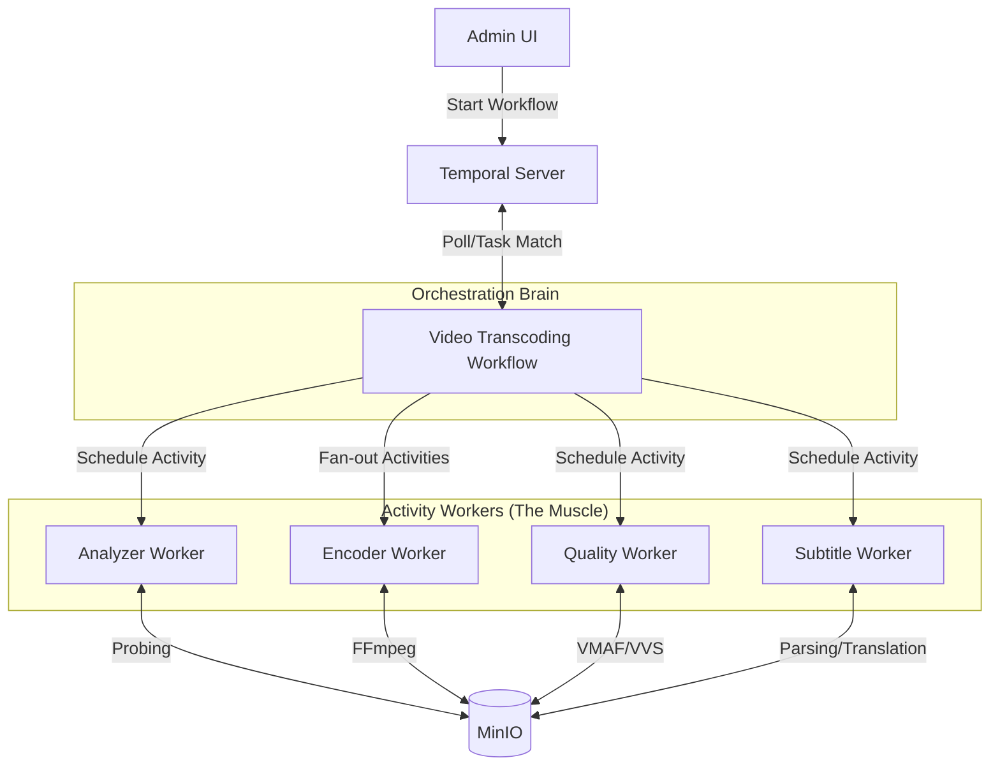

# Temporal Orchestration Architecture

This document describes the distributed transcoding architecture managed by **Temporal**. We have moved away from NATS Choreography to **Temporal Orchestration** to better handle complex state, parallel rungs, and reliable retries.

## 1. System Overview

Temporal acts as the "Central Brain" (Orchestrator), while our services act as "Activity Workers" (Muscle).

### High-Level Architecture (Temporal Model)

## 2. Why Temporal?

| Challenge | NATS Choreography | Temporal Orchestration |
| :--- | :--- | :--- |
| **State Tracking** | Manual DB counters (Race conditions!) | Native Workflow State (Built-in) |
| **Parallelism** | Hard to "wait for all rungs" | `Promise.allOf()` (Simple Barrier) |
| **Retries** | Manual logic per service | Declarative Retry Policies |
| **Visibility** | Log searching across services | Temporal UI (Visual step-by-step progress) |
| **Timeouts** | Hard to track 5-hour tasks | Built-in Heartbeats and Timeouts |

## 3. Service Roles (Activity Workers)

### 3.1 Analyzer Worker (Task Queue: `analysis-queue`)
*   **Role:** I/O bound. Probes source files and generates the bitrate ladder.
*   **Workflow Integration:** Returns a `Ladder` object containing all required resolution rungs.
*   **Implementation (repo):** **CAS** — *Complex Analysis Service* — `media-content-platform/services/transcode-services/java/cas` (`spring.application.name=cas`). See `cas/docs/README.md` and `docs/03-ANALYZER-WORKER-SPEC.md`.

### 3.2 Encoder Worker (Task Queue: `encoding-queue`)
*   **Role:** CPU bound. Executes FFmpeg for a specific resolution rung.
*   **Workflow Integration:** Executed in parallel ($N$ instances of `EncodeActivity`).
*   **Implementation (repo):** **VES** — *Video Encoding Service* — Spring Boot module `media-content-platform/services/transcode-services/java/ves` (`spring.application.name=ves`). See `ves/docs/README.md` and `docs/04-ENCODER-WORKER-SPEC.md`.

### 3.3 Quality Worker (Task Queue: `quality-queue`)
*   **Role:** CPU/GPU bound. Validates output (VVS) and scores quality (VQS/VMAF).
*   **Workflow Integration:** Returns `Pass/Fail` and `Score` to the workflow.

### 3.4 Subtitle Worker (Task Queue: `subtitle-queue`)
*   **Role:** Logic/I/O bound. Normalizes subtitle formats (SRT/TTML) to a pivot JSON format and handles automated translation.
*   **Workflow Integration:** Processes subtitle assets independently or as a child workflow.

## 4. Security Posture

*   **Trust Model:** Content is uploaded by Admins (Mezzanine files). 
*   **Sanitization:** Security is achieved via **Container Isolation** for the Encoder Workers.
*   **Scanning:** Virus scanning is reserved for small image assets (Avatar/Poster) and skipped for large video files to optimize performance.
