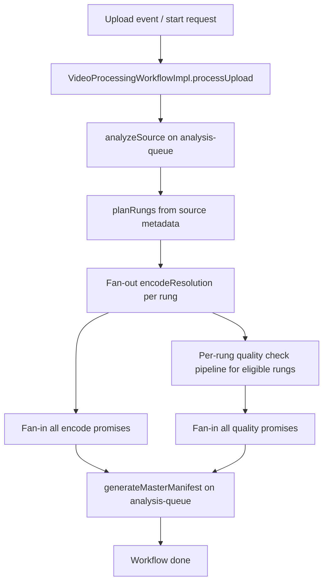
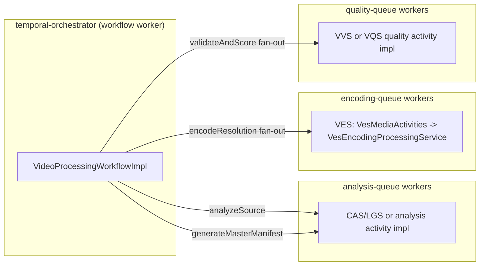
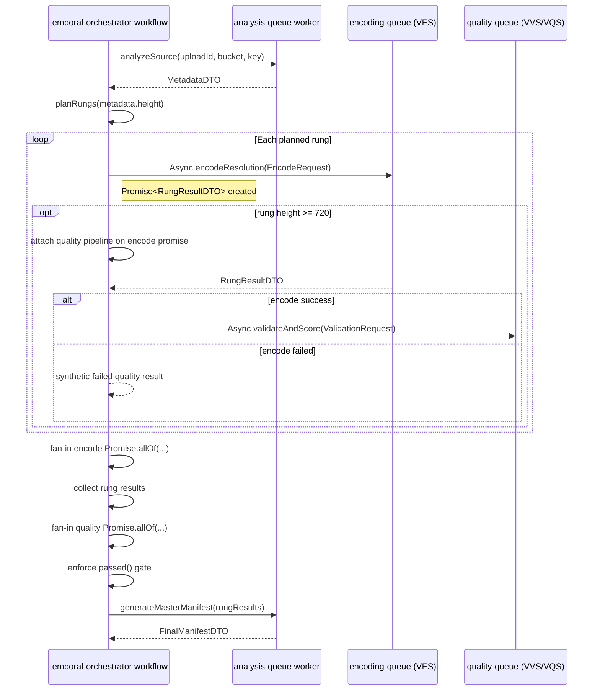
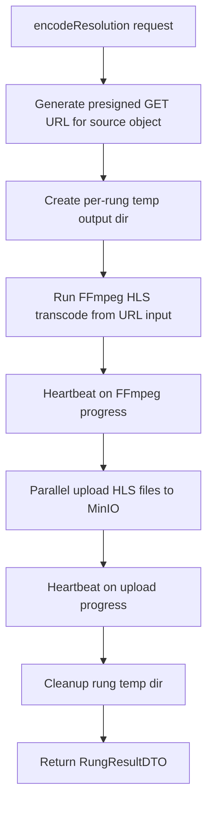

# Java Transcode Workflow Detailed Flow (Current)

## Scope

This document describes the current Java workflow path from `temporal-orchestrator` to workers, including the updated fan-out/fan-in behavior and queue boundaries.

## High-level execution flow

## Queue and worker boundaries

## Detailed sequence (fan-out/fan-in)

## VES internal flow (encode activity)

## Concurrency model summary

- Workflow fan-out happens in `VideoProcessingWorkflowImpl` using `Async.function(...)`.
- Worker-level concurrency is controlled in `VesWorkerLifecycle` with `WorkerOptions`:
  - `maxConcurrentActivityExecutionSize`
  - `maxConcurrentActivityTaskPollers`
- Per-task CPU pressure is controlled by `app.media-processing.ffmpeg-threads`.
- Upload IO parallelism is controlled by `app.media-processing.upload-parallelism`.

## Notes

- The workflow is deterministic and lightweight by design.
- Actual throughput depends on worker replica count, queue lag, CPU headroom, and MinIO throughput.
- Quality gate currently applies to eligible rungs (>=720p) and fails workflow when a required quality check fails.
