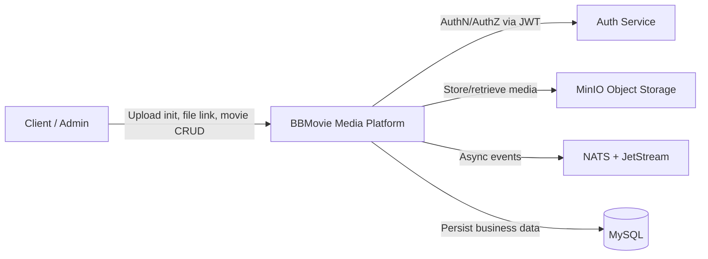
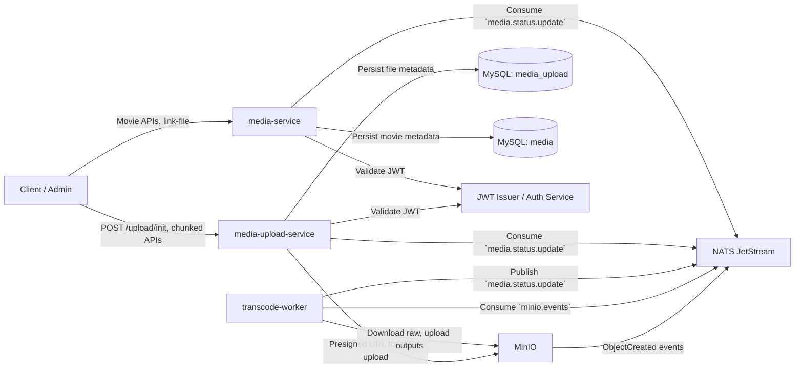
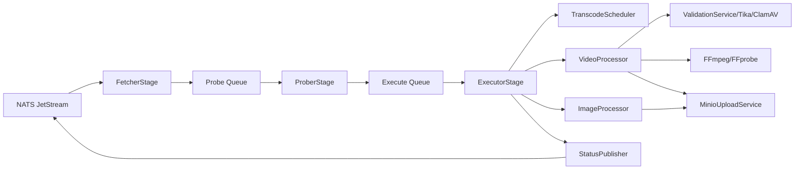

# Upload + Transcode + Media Management Architecture

This document describes the end-to-end architecture for:
- `media-upload-service`
- `transcode-worker`
- `media-service` (movie metadata source of truth)

Goals:
- Document the upload -> transcode -> management workflow
- Show C4 diagrams (Context, Container, Component)
- List dependencies and infrastructure requirements

---

## C4 Level 1 - System Context

System scope:
- Users and admins manage movie metadata and upload files.
- Platform coordinates storage, processing, and lifecycle updates through events.

---

## C4 Level 2 - Container Diagram

Container responsibilities:
- `media-upload-service`: upload orchestration, metadata persistence, file-level state tracking.
- `transcode-worker`: validation + media processing pipeline + status publishing.
- `media-service`: movie domain state transitions based on file processing outcomes.

---

## C4 Level 3 - Component Diagram (`transcode-worker`)

Pipeline model:
- **Fetcher** parses MinIO events, extracts `purpose` + `uploadId`, and creates `ProbeTask`.
- **Prober** computes probe result and estimated execution cost.
- **Executor** acquires capacity via scheduler, runs processor, publishes status.

---

## End-to-End Processing Flow

1. Client calls `media-upload-service` (`/upload/init` or chunked init).
2. Service generates `uploadId`, stores `media_files` row as `INITIATED`, returns presigned upload URL.
3. Client uploads directly to MinIO raw bucket.
4. MinIO emits `ObjectCreated` event to NATS (`minio.events`).
5. `transcode-worker` consumes event and runs pipeline (fetch/probe/execute).
6. Worker validates media and processes by purpose:
   - `MOVIE_SOURCE`, `MOVIE_TRAILER`: HLS transcoding + key separation.
   - `MOVIE_POSTER`, `USER_AVATAR`: image processing.
7. Worker publishes `media.status.update` with status + optional reason/duration/filePath.
8. `media-upload-service` updates media file status.
9. `media-service` maps `fileId/uploadId` to movie and updates movie lifecycle:
   - success -> `PUBLISHED`
   - failure/rejection -> `ERROR`

---

## Message Contracts (Current Runtime Behavior)

### MinIO -> Worker
- Subject: `minio.events`
- Payload: MinIO S3-style event (`Records[]`)
- Required fields:
  - `s3.bucket.name`
  - `s3.object.key`
  - `s3.object.userMetadata` (`purpose`, `uploadId`/`videoId`)

### Worker -> Upload + Media Service
- Subject: `media.status.update`
- Typical fields:
  - `uploadId`
  - `status` (`PROCESSING`, `COMPLETED`, `FAILED`, `MALWARE_DETECTED`, `INVALID_FILE`, ...)
  - `reason` (optional)
  - `duration` (optional, video)
  - `filePath` (optional)

Recommendation:
- Formalize and version this event schema to avoid drift between `fileId` and `uploadId`.

---

## Storage Layout and Bucket Usage

Default buckets used in this flow:
- `bbmovie-raw`: uploaded source files
- `bbmovie-hls`: HLS playlists and segments
- `bbmovie-secure`: encryption keys (`.key`)
- `bbmovie-public`: processed public assets (avatars/posters)

Path conventions used by worker:
- source output: `movies/{uploadId}/...`
- trailer output: `trailers/{uploadId}/...`

---

## Service Dependencies

### `media-upload-service`
- Spring Boot (Web, Security, Data JPA)
- MinIO Java SDK
- NATS Java client
- MySQL + Liquibase
- OAuth2/JWT integration

### `transcode-worker`
- Spring Boot
- NATS Java client (JetStream)
- MinIO Java SDK
- FFmpeg + FFprobe
- Apache Tika
- ClamAV (configurable on/off)

### `media-service`
- Spring Boot (Web, Security, Data JPA)
- NATS Java client
- MySQL
---

## Infrastructure Requirements

Minimum environment:
- MySQL databases:
  - one schema for upload metadata
  - one schema for movie metadata
- MinIO with required buckets and event notifications to NATS
- NATS + JetStream:
  - `minio.events`
  - `media.status.update`
  - durable stream/consumer configuration for worker
- Compute node(s) for `transcode-worker`:
  - FFmpeg/FFprobe installed
  - sufficient temp disk (`TEMP_DIR`)
  - CPU/RAM sized for concurrent transcode workload
- Shared JWT trust configuration (issuer/JWK)
- Secret management for DB/MinIO/NATS credentials

Production recommendations:
- TLS everywhere (API, MinIO endpoint, NATS when applicable)
- Metrics and alerts for queue lag, failure ratio, processing latency
- Centralized logs and trace correlation by `uploadId`

---

## Deployment Sequence

1. Provision MySQL schemas and run migrations.
2. Provision MinIO and create all required buckets.
3. Provision NATS JetStream (stream + subjects + durable consumer).
4. Configure MinIO notifications to publish object-created events to `minio.events`.
5. Start `media-upload-service`.
6. Start `media-service`.
7. Install FFmpeg/FFprobe and start `transcode-worker`.
8. Run E2E verification:
   - init upload -> upload object -> worker process -> status events -> movie status transition

---

## Risks and Open Design Points

- Event contract inconsistency: `fileId` vs `uploadId` mapping is currently tolerant but should be unified.
- Legacy status overlap (`READY` vs `COMPLETED`, `TRANSCODING` vs `PROCESSING`) can confuse consumers.
- Event redelivery requires idempotent handlers in all consumers.
- Retention/cleanup policy for failed raw uploads and temp artifacts should be explicit.

---

## Short-Term Improvements

1. Define versioned schema for `media.status.update`.
2. Publish a cross-service status mapping table and deprecation plan.
3. Add operational dashboard:
   - throughput
   - p95 processing time
   - top failure reasons
4. Add explicit retry + dead-letter handling strategy for non-recoverable event failures.

