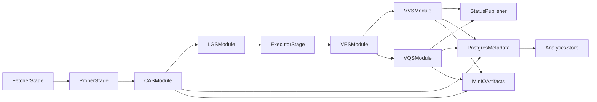

# Netflix-Style CAS/VVS/VQS Implementation Plan

## Scope And Target
Triển khai kiến trúc giống Netflix theo 2 bước: (1) xây domain modules chuẩn trong `transcode-worker`, (2) tạo seam để tách thành microservices sau khi ổn định. Data layer dùng hybrid advanced: Postgres + MinIO + analytics store.

## Current Baseline To Reuse
- Có CAS-lite: probing + ladder + cost (`ProbeResult`, `LadderGenerationService`, `ResolutionCostCalculator`).
- Đã có phase-0 contracts/no-op cho CAS/VVS/VQS.
- Pipeline hiện tại: Fetch -> Probe -> Execute (`PipelineOrchestratorSetup`, `ProberStage`, `ExecutorStage`).

## Target Architecture (Modular-First, Netflix-Style)

## Data Platform Design
- Postgres:
  - transactional metadata + lifecycle states + queryable summaries.
  - tables: `analysis_job`, `complexity_profile`, `quality_report`, `validation_report`, `rendition_report`.
- MinIO:
  - raw artifacts (full ffprobe dump, VMAF JSON/log, validation evidence).
- Analytics store (ClickHouse or Elasticsearch):
  - denormalized time-series/events cho dashboard, trend, percentile latency, quality drift.
- Ingestion model:
  - write-through từ modules: Postgres + artifact URI, sau đó async publish event để sink sang analytics store.

## Phase Plan

### Phase 1: Solidify Module Contracts (no behavior break)
- Chuẩn hóa DTO + enums + persistence model versioning.
- Tạo package boundaries:
  - `service/complexity` (CAS)
  - `service/ladder` (LGS)
  - `service/validation/encode` (VVS)
  - `service/quality` (VQS)
- Add orchestration interfaces để `ExecutorStage` gọi VVS/VQS bằng policy, không hard-wire.

### Phase 2: VVS Production MVP
- Implement ffprobe-based validation rules:
  - codec/profile/level, width-height, bitrate range, audio presence/codec/channels/sample rate, duration tolerance.
- Persist validation summary vào Postgres, chi tiết vào MinIO.
- Policy by config: `fail-on-vvs` vs `warn-only`.

### Phase 3: VQS Production MVP
- Implement VMAF runner (`ffmpeg + libvmaf`) với fallback SSIM/PSNR.
- Sampling policy per ladder rung để kiểm soát cost.
- Persist score summary + artifact pointers; stream denormalized metrics sang analytics store.

### Phase 4: CAS Upgrade (from CAS-lite to CAS-real)
- Bổ sung feature extraction (motion, texture proxies, scene-change density).
- Add sample-encode + VQS feedback loop để sinh `RecipeHints` cho LGS.
- Cache/reuse complexity profile theo source hash + encode family.

### Phase 5: Extraction Seams For Future Microservices
- Tạo boundary adapters cho CAS/VVS/VQS:
  - in-process adapter (default)
  - remote client adapter (future microservice).
- Chuẩn hóa event contracts (NATS subjects + schema version).

## Code Areas To Change First
- Core orchestration:
  - [backend/transcode-worker/src/main/java/com/bbmovie/transcodeworker/service/pipeline/stage/ExecutorStage.java](backend/transcode-worker/src/main/java/com/bbmovie/transcodeworker/service/pipeline/stage/ExecutorStage.java)
  - [backend/transcode-worker/src/main/java/com/bbmovie/transcodeworker/service/processing/VideoProcessor.java](backend/transcode-worker/src/main/java/com/bbmovie/transcodeworker/service/processing/VideoProcessor.java)
- Module contracts and implementations:
  - [backend/transcode-worker/src/main/java/com/bbmovie/transcodeworker/service/validation/encode](backend/transcode-worker/src/main/java/com/bbmovie/transcodeworker/service/validation/encode)
  - [backend/transcode-worker/src/main/java/com/bbmovie/transcodeworker/service/quality](backend/transcode-worker/src/main/java/com/bbmovie/transcodeworker/service/quality)
  - [backend/transcode-worker/src/main/java/com/bbmovie/transcodeworker/service/complexity](backend/transcode-worker/src/main/java/com/bbmovie/transcodeworker/service/complexity)
- Config:
  - [backend/transcode-worker/src/main/resources/application.properties](backend/transcode-worker/src/main/resources/application.properties)

## Delivery Rules
- Feature-flag each module (`cas`, `vvs`, `vqs`) and rollout by environment.
- Idempotent writes keyed by `uploadId + rendition + analysisVersion`.
- Keep fast path bounded: VQS/CAS heavy tasks should be throttled by scheduler quotas.
- Add integration tests using small fixed media fixtures for deterministic assertions.

## Success Criteria
- VVS and VQS produce queryable reports + artifact links per rendition.
- CAS output influences LGS decisions beyond static height rules.
- System handles retries without duplicate logical reports.
- Modules can be switched from in-process to remote adapter without changing pipeline business flow.