# ADR-004: Class Refactoring cho 3-Stage Pipeline Architecture

## Status
**Accepted & Implemented** - 2025-12-25

## Context

Sau khi chấp nhận ADR-003 (3-Stage Pipeline Architecture), cần phân tích và refactor lại cấu trúc class để:
1. Phù hợp với 3-Stage Architecture
2. Loại bỏ code duplication
3. Chia nhỏ trách nhiệm (Single Responsibility Principle)
4. Chuẩn bị cho Stream-based processing (ClamAV, FFprobe)

## Diagrams

### Architecture cũ (Hiện tại)



**Vấn đề chính:**
- `MediaEventConsumer` làm quá nhiều việc (6 dependencies trực tiếp)
- `MetadataService` được gọi 2 lần (duplicate I/O)
- Không có separation of concerns

### Architecture mới (3-Stage Pipeline)


**Cải thiện:**
- 3 stages tách biệt: Fetcher → Prober → Executor
- `MetadataService` chỉ được gọi 1 lần (trong FastProbeService)
- Data flow qua DTOs (ProbeTask → ExecuteTask)
- Stream-based processing support

---

## Phân tích hiện tại

### Cấu trúc thư mục hiện tại

```
service/
├── ffmpeg/
│   ├── EncryptionService.java
│   ├── FFmpegVideoMetadata.java
│   ├── ImageProcessingService.java
│   ├── MetadataService.java          ← 54 lines, OK
│   ├── VideoTranscoderService.java   ← 553 lines, QUÁ LỚN
│   └── option/
│       ├── CodecOptions.java
│       ├── PresetOptions.java
│       └── VideoExtension.java
├── nats/
│   └── MediaEventConsumer.java       ← 594 lines, QUÁ LỚN
├── scheduler/
│   ├── ResolutionCostCalculator.java ← OK
│   └── TranscodeScheduler.java       ← OK, cần thêm tryAcquire
└── validation/
    ├── ClamAVService.java            ← OK, đã hỗ trợ InputStream
    └── TikaValidationService.java    ← Cần thêm InputStream support
```

### Vấn đề #1: MetadataService Duplicate Injection

```
┌─────────────────────────────────────────────────────────────────────────┐
│                    DUPLICATE DEPENDENCY                                  │
├─────────────────────────────────────────────────────────────────────────┤
│                                                                          │
│  MediaEventConsumer                                                      │
│  └── metadataService.getMetadata(input)  ← Line 455                     │
│                                                                          │
│  VideoTranscoderService                                                  │
│  └── metadataService.getMetadata(input)  ← Line 150                     │
│                                                                          │
│  ❌ CẢ HAI đều gọi getMetadata() cho CÙNG FILE!                         │
│  ❌ Metadata được extract 2 lần, lãng phí I/O                           │
└─────────────────────────────────────────────────────────────────────────┘
```

### Vấn đề #2: MediaEventConsumer làm quá nhiều việc

| Responsibility | Lines | Stage |
|----------------|-------|-------|
| NATS JetStream setup | 100-193 | Stage 1 |
| Worker loop (fetch) | 206-248 | Stage 1 |
| Heartbeat management | 269-311 | Stage 3 |
| Message parsing | 284-294 | Stage 2 |
| MinIO file download | 378-386 | Stage 3 |
| Validation (Tika, ClamAV) | 390-398 | Stage 3 |
| Route to processor | 449-488 | Stage 3 |
| Upload results | 529-567 | Stage 3 |
| Publish status | 579-593 | Stage 3 |

**Kết luận**: MediaEventConsumer đang làm việc của CẢ 3 STAGES!

### Vấn đề #3: VideoTranscoderService làm quá nhiều việc

| Responsibility | Lines |
|----------------|-------|
| Resolution definitions | 74-135 |
| Transcode orchestration | 149-213 |
| HLS execution | 231-314 |
| Encryption key management | 328-391 |
| Playlist management | 403-520 |

**Kết luận**: Có thể tách thành smaller services (Encryption, Playlist).

### Vấn đề #4: Không có Stream-based processing

Hiện tại:
```java
// ClamAVService - ĐÃ hỗ trợ InputStream ✓
try (InputStream is = Files.newInputStream(filePath)) {
    ScanResult scanResult = clamAVClient.scan(is);
}

// TikaValidationService - CHƯA hỗ trợ InputStream ✗
String detectedContentType = tika.detect(path.toFile());

// MetadataService - CHƯA hỗ trợ URL/Stream ✗
FFmpegProbeResult probeResult = ffprobe.probe(videoPath.toString());
```

## Decision

### Cấu trúc mới cho 3-Stage Pipeline

```
service/
├── pipeline/                           # NEW: 3-Stage Pipeline
│   ├── PipelineOrchestrator.java      # Khởi tạo và quản lý stages
│   ├── stage/
│   │   ├── FetcherStage.java          # Stage 1: NATS → probeQueue
│   │   ├── ProberStage.java           # Stage 2: probeQueue → executeQueue
│   │   └── ExecutorStage.java         # Stage 3: executeQueue → ACK
│   ├── queue/
│   │   └── PipelineQueues.java        # BlockingQueues configuration
│   └── dto/
│       ├── ProbeTask.java             # Data: Fetcher → Prober
│       └── ExecuteTask.java           # Data: Prober → Executor
│
├── nats/                               # REFACTORED
│   ├── NatsConnectionManager.java     # NATS setup, stream/consumer
│   ├── HeartbeatManager.java          # Heartbeat management
│   └── StatusPublisher.java           # Publish status events
│
├── storage/                            # NEW: MinIO operations
│   ├── MinioDownloadService.java      # Download files (full + partial)
│   ├── MinioUploadService.java        # Upload results
│   └── PresignedUrlService.java       # Generate presigned URLs
│
├── probe/                              # NEW: Fast probing
│   ├── FastProbeService.java          # Coordinate probe strategies
│   ├── strategy/
│   │   ├── ProbeStrategy.java         # Interface
│   │   ├── PresignedUrlProbe.java     # Probe via presigned URL
│   │   ├── PartialDownloadProbe.java  # Probe via partial download
│   │   └── StreamPipeProbe.java       # Probe via stdin pipe
│   └── ProbeResult.java               # Result DTO
│
├── ffmpeg/                             # REFACTORED
│   ├── MetadataService.java           # Add URL/Stream support
│   ├── VideoTranscoderService.java    # Simplified: only transcode
│   ├── HlsEncryptionService.java      # EXTRACTED from VideoTranscoderService
│   ├── PlaylistService.java           # EXTRACTED from VideoTranscoderService
│   ├── ImageProcessingService.java    # Unchanged
│   └── ...
│
├── validation/                         # REFACTORED
│   ├── ClamAVService.java             # Unchanged (already stream-ready)
│   ├── TikaValidationService.java     # Add InputStream support
│   └── ValidationOrchestrator.java    # NEW: Coordinate validations
│
└── scheduler/                          # REFACTORED
    ├── TranscodeScheduler.java        # Add tryAcquire() method
    └── ResolutionCostCalculator.java  # Unchanged
```

### Sơ đồ phụ thuộc mới

```
┌─────────────────────────────────────────────────────────────────────────┐
│                     DEPENDENCY DIAGRAM (NEW)                             │
├─────────────────────────────────────────────────────────────────────────┤
│                                                                          │
│  ┌─────────────────────────────────────────────────────────────────┐    │
│  │                    PipelineOrchestrator                          │    │
│  │  - Start/stop all stages                                         │    │
│  │  - Manage queues                                                 │    │
│  │  - Graceful shutdown                                             │    │
│  └───────────┬─────────────────────────────────┬───────────────────┘    │
│              │                                 │                         │
│              ▼                                 ▼                         │
│  ┌───────────────────────┐         ┌───────────────────────┐            │
│  │     FetcherStage      │         │      ProberStage      │            │
│  │                       │         │                       │            │
│  │ Dependencies:         │         │ Dependencies:         │            │
│  │ - NatsConnectionMgr   │────────▶│ - FastProbeService    │            │
│  │ - PipelineQueues      │ probe   │ - TranscodeScheduler  │            │
│  │                       │ Queue   │ - ResolutionCostCalc  │            │
│  └───────────────────────┘         │ - PipelineQueues      │            │
│                                    │ - HeartbeatManager    │            │
│                                    └───────────┬───────────┘            │
│                                                │                         │
│                                                │ execute                 │
│                                                │ Queue                   │
│                                                ▼                         │
│                                    ┌───────────────────────┐            │
│                                    │    ExecutorStage      │            │
│                                    │                       │            │
│                                    │ Dependencies:         │            │
│                                    │ - MinioDownloadSvc    │            │
│                                    │ - ValidationOrch.     │            │
│                                    │ - VideoTranscoderSvc  │            │
│                                    │ - ImageProcessingSvc  │            │
│                                    │ - MinioUploadService  │            │
│                                    │ - StatusPublisher     │            │
│                                    │ - HeartbeatManager    │            │
│                                    │ - TranscodeScheduler  │            │
│                                    └───────────────────────┘            │
│                                                                          │
│  ┌─────────────────────────────────────────────────────────────────┐    │
│  │                    FastProbeService                              │    │
│  │                                                                   │    │
│  │ Dependencies:                                                     │    │
│  │ - PresignedUrlService                                            │    │
│  │ - MetadataService (with URL support)                             │    │
│  │ - MinioDownloadService (for partial download)                    │    │
│  │                                                                   │    │
│  │ Strategies:                                                       │    │
│  │ - PresignedUrlProbe (preferred)                                  │    │
│  │ - PartialDownloadProbe (fallback)                                │    │
│  │ - StreamPipeProbe (alternative)                                  │    │
│  └─────────────────────────────────────────────────────────────────┘    │
│                                                                          │
└─────────────────────────────────────────────────────────────────────────┘
```

### Data Transfer Objects (DTOs)

#### ProbeTask (Fetcher → Prober)

```java
public record ProbeTask(
    Message natsMessage,       // NATS message để ACK/NAK
    String bucket,             // MinIO bucket
    String key,                // MinIO object key
    UploadPurpose purpose,     // MOVIE_SOURCE, TRAILER, etc.
    String uploadId,           // Upload ID từ metadata
    Instant fetchedAt          // Timestamp để track latency
) {}
```

#### ExecuteTask (Prober → Executor)

```java
public record ExecuteTask(
    Message natsMessage,                    // NATS message để ACK
    String bucket,
    String key,
    UploadPurpose purpose,
    String uploadId,
    ProbeResult probeResult,                // Resolution, duration, cost
    TranscodeScheduler.ResourceHandle handle, // Acquired resources
    Instant probedAt
) {}
```

#### ProbeResult

```java
public record ProbeResult(
    int width,
    int height,
    double duration,
    String codec,
    List<VideoResolution> targetResolutions,
    int peakCost,              // Max single resolution cost
    int totalCost              // Sum of all resolution costs
) {}
```

### Giải quyết MetadataService Duplicate

**Trước (Duplicate):**
```java
// MediaEventConsumer.java line 455
var metadata = metadataService.getMetadata(input);
var resolutions = videoTranscoderService.determineTargetResolutions(metadata);

// VideoTranscoderService.java line 150
FFmpegVideoMetadata meta = metadataService.getMetadata(input);
```

**Sau (No Duplicate):**
```java
// ProberStage - probe ONCE, pass result forward
ProbeResult result = fastProbeService.probe(bucket, key);

// ExecutorStage - receive probeResult, pass to transcoder
videoTranscoderService.transcode(input, executeTask.probeResult().targetResolutions(), ...);

// VideoTranscoderService - NO LONGER calls metadataService
// Receives metadata via ProbeResult
```

### Stream-based Processing

#### MetadataService - Add URL Support

```java
@Service
public class MetadataService {
    
    // Existing: File-based
    public FFmpegVideoMetadata getMetadata(Path videoPath) { ... }
    
    // NEW: URL-based (for presigned URL probing)
    public FFmpegVideoMetadata getMetadataFromUrl(String url) {
        try {
            FFmpegProbeResult probeResult = ffprobe.probe(url);
            // ... same parsing logic
        } catch (IOException e) {
            throw new RuntimeException("Failed to probe URL", e);
        }
    }
    
    // NEW: Partial file (for partial download probing)
    public FFmpegVideoMetadata getMetadataFromPartial(byte[] partialData) {
        // Write to temp file, probe, delete
        Path tempFile = Files.createTempFile("probe", ".tmp");
        try {
            Files.write(tempFile, partialData);
            return getMetadata(tempFile);
        } finally {
            Files.deleteIfExists(tempFile);
        }
    }
}
```

#### TikaValidationService - Add Stream Support

```java
@Service
public class TikaValidationService {
    
    // Existing: File-based
    public void validate(Path path, UploadPurpose purpose) { ... }
    
    // NEW: Stream-based
    public void validate(InputStream stream, UploadPurpose purpose) {
        try {
            String detectedContentType = tika.detect(stream);
            // ... same validation logic
        } catch (Exception e) {
            throw new RuntimeException("Validation failed", e);
        }
    }
}
```

#### FastProbeService - Strategy Pattern

```java
@Service
public class FastProbeService {
    
    private final List<ProbeStrategy> strategies;
    
    public FastProbeService(
            PresignedUrlProbe presignedProbe,
            PartialDownloadProbe partialProbe,
            StreamPipeProbe streamProbe) {
        // Order by preference
        this.strategies = List.of(presignedProbe, partialProbe, streamProbe);
    }
    
    public ProbeResult probe(String bucket, String key) {
        for (ProbeStrategy strategy : strategies) {
            if (strategy.supports(bucket, key)) {
                try {
                    return strategy.probe(bucket, key);
                } catch (Exception e) {
                    log.warn("Strategy {} failed, trying next", strategy.getName(), e);
                }
            }
        }
        throw new RuntimeException("All probe strategies failed");
    }
}
```

### TranscodeScheduler - Add tryAcquire

```java
@Component
public class TranscodeScheduler {
    
    // Existing: blocking acquire
    public ResourceHandle acquire(int costWeight) throws InterruptedException { ... }
    
    // NEW: non-blocking tryAcquire with timeout
    public Optional<ResourceHandle> tryAcquire(int costWeight, Duration timeout) {
        int actualThreads = Math.min(costWeight, maxCapacity);
        
        try {
            boolean acquired = semaphore.tryAcquire(
                actualThreads, 
                timeout.toMillis(), 
                TimeUnit.MILLISECONDS
            );
            
            if (acquired) {
                int newUsage = currentUsage.addAndGet(actualThreads);
                log.info("Acquired {} slots via tryAcquire - Total: {}/{}", 
                    actualThreads, newUsage, maxCapacity);
                return Optional.of(new ResourceHandle(costWeight, actualThreads));
            }
            
            return Optional.empty();
            
        } catch (InterruptedException e) {
            Thread.currentThread().interrupt();
            return Optional.empty();
        }
    }
    
    // NEW: check available capacity
    public int getAvailableCapacity() {
        return maxCapacity - currentUsage.get();
    }
}
```

## Migration Plan

### Phase 1: Infrastructure (Non-breaking)
1. ✅ Tạo `pipeline/` package với DTOs
2. ✅ Tạo `storage/` package (extract MinIO operations)
3. ✅ Tạo `probe/` package với FastProbeService
4. ✅ Add `tryAcquire()` to TranscodeScheduler

### Phase 2: Refactor Existing (Parallel)
1. ✅ Add URL support to MetadataService
2. ✅ Add Stream support to TikaValidationService
3. ✅ Extract NatsConnectionManager từ MediaEventConsumer
4. ✅ Extract StatusPublisher từ MediaEventConsumer

### Phase 3: Implement Stages
1. ✅ Implement FetcherStage
2. ✅ Implement ProberStage
3. ✅ Implement ExecutorStage
4. ✅ Implement PipelineOrchestrator

### Phase 4: Switch & Cleanup
1. ✅ Feature flag để switch giữa old và new
2. ✅ Testing với mixed workload
3. ✅ Remove old MediaEventConsumer code
4. ✅ Cleanup deprecated methods

## Consequences

### ✅ Advantages

| Aspect | Benefit |
|--------|---------|
| **Single Responsibility** | Mỗi class làm 1 việc rõ ràng |
| **No Duplicate** | MetadataService chỉ được gọi 1 lần |
| **Stream-ready** | Chuẩn bị cho xử lý stream ClamAV, FFprobe |
| **Testable** | Mỗi stage có thể test độc lập |
| **Scalable** | Stages có thể scale độc lập |
| **3-Stage Ready** | Phù hợp với Pipeline Architecture |

### ⚠️ Trade-offs

| Aspect | Trade-off | Mitigation |
|--------|-----------|------------|
| **More classes** | ~15 classes mới | Clean package structure |
| **Migration effort** | ~2-3 sprints | Phased approach |
| **Learning curve** | Team cần hiểu architecture mới | ADRs và documentation |

## Configuration

```properties
# Pipeline
app.pipeline.probe-queue-capacity=100
app.pipeline.execute-queue-capacity=50
app.pipeline.prober-thread-count=20

# Probe Strategy
app.probe.strategy=presigned-url  # presigned-url | partial-download | stream-pipe
app.probe.partial-size-mb=10
app.probe.timeout-seconds=30

# Feature Flag (migration)
app.pipeline.enabled=false  # Set true to enable new pipeline
```

## References

- ADR-001: Pull Subscription với Scheduler Integration
- ADR-002: AI Council Review - Phân tích các vấn đề tiềm ẩn
- ADR-003: 3-Stage Pipeline Architecture

