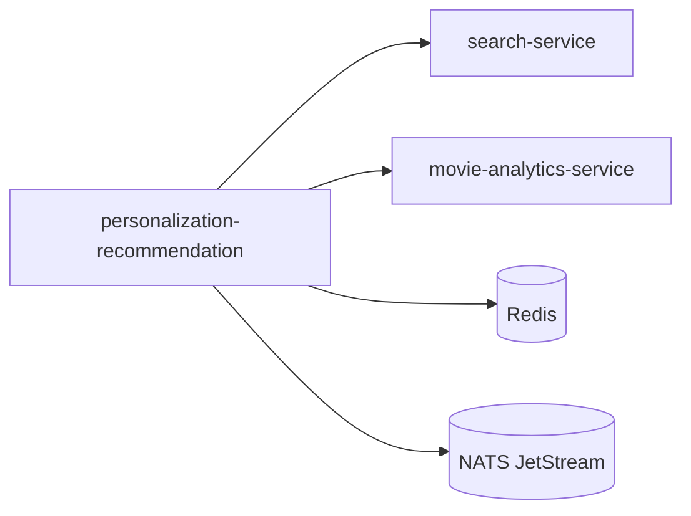

Câu hỏi rất hay ông ơi! Đây chính là **nỗi đau chung** của mọi team làm microservices. Big Tech (Google, Meta, Netflix, Spotify) họ giải quyết vấn đề này bằng **hệ sinh thái documentation + automation**, không phải bằng "văn bản Word" như mình hay làm.

Dưới đây là **kiến trúc thực tế** họ dùng để quản lý dependency và tránh "chết chùm":

---

## 🗂️ 1. Họ viết docs ở đâu? → "Docs-as-Code" + Developer Portal

### ✅ Pattern: **Docs sống cùng code, không tách rời**

| Công ty | Platform | Cách hoạt động |
|---------|----------|---------------|
| **Spotify** | **Backstage + TechDocs** [[30]][[37]] | Docs viết bằng Markdown trong repo code → auto build thành site trong Backstage |
| **Google** | **go/links + AIP (API Improvement Proposals)** [[42]] | Mỗi API có file `API.md` + proposal cho breaking change |
| **Netflix** | **Internal Wiki + OpenAPI + Pact** | Contract test + docs tự sync từ code |
| **Meta** | **Phabricator + Docs repo** | Code review + docs review cùng một chỗ |

### 🔧 Triển khai cho dự án của ông (dùng Backstage - Open Source):

```yaml
# backend/personalization-recommendation/catalog-info.yaml
# Đây là "ID card" của service trong Backstage
apiVersion: backstage.io/v1alpha1
kind: Component
metadata:
  name: personalization-recommendation
  description: Recommendation ranking service
  annotations:
    github.com/project-slug: yourorg/movie-platform
    backstage.io/techdocs-ref: dir:docs
    # Dependency declarations → auto visualize
    backstage.io/dependsOn: |
      - component:search-service
      - component:movie-analytics-service
      - resource:nats-cluster
      - resource:redis-cluster
spec:
  type: service
  lifecycle: production
  owner: team-recommendation
  system: movie-platform
  providesApis:
    - recommendation-api-v1
  consumesApis:
    - search-api-v1
    - analytics-api-v1
```

```markdown
# backend/personalization-recommendation/docs/index.md
# TechDocs - viết cùng code, render tự động

# Personalization Recommendation Service

## 🎯 Responsibility
Ranking + orchestration layer cho recommendation

## 🔗 Dependencies (Auto-generated từ catalog-info.yaml)


## 📡 API Contract
```yaml
# OpenAPI 3.0 - copy từ src/main/resources/openapi.yaml
openapi: 3.0.3
info:
  title: Recommendation API
  version: v1
paths:
  /api/personalization/v1/users/{userId}/recommendations:
    get:
      parameters:
        - name: limit
          in: query
          schema: { type: integer, default: 20 }
      responses:
        '200':
          content:
            application/json:
              schema: { $ref: '#/components/schemas/RecommendationResponse' }
```

## 🔄 Change Impact Guide
| API thay đổi | Ảnh hưởng đến | Cách test |
|-------------|-------------|-----------|
| `GET /recommendations` thêm field | Frontend, Homepage Service | Pact contract test |
| NATS subject đổi tên | Analytics Service | Integration test + consumer check |
| Redis key pattern đổi | Cache layer | Smoke test + canary deploy |
```

> 💡 **Cài đặt Backstage local**:
```bash
npx @backstage/create-app@latest
# Thêm plugin: techdocs, catalog, kubernetes
# Docs tự build khi push code → không cần deploy riêng
```

---

## 🔗 2. Làm sao để thấy sự liên kết/phụ thuộc giữa services?

### ✅ Pattern: **Service Catalog + Dependency Graph**

Big Tech không dùng Excel hay vẽ tay. Họ dùng **metadata + automation**:

#### A. Declarative Dependency trong `catalog-info.yaml` (Backstage)
```yaml
# Khai báo dependency dạng code
spec:
  consumesApis:
    - search-api-v1
    - analytics-api-v1
  dependsOn:
    - component:search-service
    - resource:redis-cluster
```

→ Backstage auto vẽ graph: [[30]]

#### B. Runtime Dependency Discovery (Service Mesh)
Dùng **Istio + Kiali** để thấy traffic thực tế: [[28]]

```bash
# Cài Kiali trong cluster
istioctl dashboard kiali
```


→ Thấy ngay: Service A gọi B bao nhiêu RPS, latency bao nhiêu, error rate thế nào.

#### C. Contract Testing với **Pact** (Tránh breaking change) [[19]][[11]]

```java
// consumer: personalization-recommendation
// test để đảm bảo search-service không breaking change
@PactTestFor(providerName = "search-service", port = "8081")
public class SearchServiceContractTest {

    @Pact(consumer = "personalization-recommendation")
    public PactFragment createCandidateSearchPact(PactDslWithProvider builder) {
        return builder
            .given("movie m_001 exists")
            .uponReceiving("search candidates for user")
            .path("/api/search/v1/candidates")
            .queryParameter("userId", "u_123")
            .willRespondWith()
            .status(200)
            .body("{\"candidates\":[{\"movieId\":\"m_001\",\"score\":0.95}]}")
            .toPact();
    }
}
```

```yaml
# CI/CD: Chạy contract test trước khi deploy
# Nếu search-service thay đổi API → test fail → block deploy
steps:
  - name: Run Pact verification
    run: ./gradlew pactVerify
  - name: Check can-i-deploy
    run: pact-broker can-i-deploy \
      --participant personalization-recommendation --version $VERSION \
      --broker-url $PACT_BROKER_URL
```

→ **Pact Broker** lưu contract, so sánh version, báo "có thể deploy hay không" [[19]].

---

## 🛡️ 3. Quy trình thay đổi API để không "chết chùm"

Google có **AIP (API Improvement Proposal)** process rất chặt [[42]]:

### ✅ Google's API Change Workflow:

```
1. Viết AIP proposal (Markdown trong repo)
   ↓
2. Review với team consumer + architecture board
   ↓
3. Implement với versioning strategy:
   - v1: stable (không breaking)
   - v1beta: testing (có thể breaking)
   - v1alpha: experimental
   ↓
4. Deprecation timeline (nếu breaking):
   - Tháng 1-3: Thêm header `Deprecation: true` + log warning
   - Tháng 4-6: Contact remaining users + monitoring
   - Tháng 7-9: Trả về 410 Gone + redirect docs
   ↓
5. Sunset old version
```

### ✅ Áp dụng cho dự án của ông (Lightweight version):

#### Bước 1: API Versioning trong code
```java
@RestController
@RequestMapping("/api/personalization")
public class RecommendationController {

    // v1 - stable
    @GetMapping("/v1/users/{userId}/recommendations")
    public ResponseEntity<RecommendationResponse> v1(...) { ... }

    // v2 - beta (có breaking change)
    @GetMapping("/v2/users/{userId}/recommendations")
    @Deprecated // Annotation + header
    public ResponseEntity<RecommendationResponseV2> v2(...) {
        response.getHeaders().add("Deprecation", "true");
        response.getHeaders().add("Sunset", "2026-12-31");
        return ...;
    }
}
```

#### Bước 2: Consumer Detection Script
```bash
# scripts/check-api-consumers.sh
# Query logs/metrics để tìm service nào còn gọi API cũ

# Ví dụ: check NATS subject usage
nats stream info PLAYBACK_EVENTS --server=$NATS_URL | grep "personalization.v1"

# Ví dụ: check API gateway logs
grep "GET /api/personalization/v1" /var/log/gateway/access.log | \
  awk '{print $1}' | sort | uniq -c
```

#### Bước 3: Canary Deploy + Feature Flag
```java
// Dùng LaunchDarkly hoặc config đơn giản
@Value("${features.recommendation.v2.enabled:false}")
private boolean enableV2;

public RecommendationResponse getRecommendations(String userId) {
    if (enableV2 && isUserInCanary(userId)) {
        return v2Logic(userId); // Test với 1% user trước
    }
    return v1Logic(userId); // Fallback an toàn
}
```

---

## 🧰 4. Tool Stack đề xuất cho dự án của ông

| Mục đích | Tool đề xuất | Lý do |
|----------|-------------|-------|
| **Docs-as-Code** | Backstage + TechDocs [[37]] | Open source, Markdown, auto build |
| **Dependency Graph** | Backstage Catalog + Mermaid | Declarative, auto visualize |
| **Runtime Observability** | Istio + Kiali [[28]] | See real traffic, latency, error |
| **Contract Testing** | Pact + Pact Broker [[19]] | Prevent breaking change, CI/CD integration |
| **API Versioning** | Spring Boot `@Deprecated` + Header | Simple, no extra dependency |
| **Change Impact Analysis** | Custom script + Grafana dashboard | Lightweight, đủ cho team nhỏ |

---

## 🚀 Quick Start: Setup Backstage + TechDocs trong 30 phút

```bash
# 1. Tạo Backstage app
npx @backstage/create-app@latest movie-platform-portal
cd movie-platform-portal

# 2. Enable TechDocs plugin
# (đã có sẵn trong template)

# 3. Thêm service của ông vào catalog
# Tạo file: packages/entities/personalization-recommendation/catalog-info.yaml
# (như ví dụ ở trên)

# 4. Tạo docs folder
mkdir -p backend/personalization-recommendation/docs
echo "# Personalization Service" > backend/personalization-recommendation/docs/index.md

# 5. Chạy local
yarn dev
# Truy cập: http://localhost:3000 → thấy catalog + docs tự động
```

→ Giờ mỗi khi ông change API, chỉ cần:
1. Update `catalog-info.yaml` nếu đổi dependency
2. Update `docs/index.md` với change log
3. Chạy Pact test trong CI
4. Deploy với canary flag

→ **Consumer tự thấy change** qua Backstage portal, không cần email/họp.

---

## 🎯 Tóm lại: Checklist để không "chết chùm"

```markdown
## Trước khi change API:
- [ ] Update `catalog-info.yaml` nếu thêm/xóa dependency
- [ ] Viết/change OpenAPI spec trong `src/main/resources/openapi.yaml`
- [ ] Chạy `pact verify` để check consumer compatibility
- [ ] Thêm `@Deprecated` + header nếu breaking change
- [ ] Update `docs/index.md` với migration guide

## Trong CI/CD:
- [ ] Chạy contract test (Pact)
- [ ] Check `can-i-deploy` với Pact Broker
- [ ] Deploy canary 1% traffic trước
- [ ] Monitor error rate + latency 24h

## Sau khi deploy:
- [ ] Query logs để tìm consumer còn dùng old version
- [ ] Notify qua Backstage/Slack nếu có breaking change
- [ ] Set sunset date trong docs + header
```

> 💡 **Mantra của Big Tech**: *"If it's not documented, it doesn't exist. If it's not tested, it will break."*

Ông thấy workflow này có khả thi để áp dụng từng bước không? Cần mình viết chi tiết phần cài đặt Backstage hoặc Pact integration cho Spring Boot không? 🔧


Chuẩn luôn ông ơi! 😂 Đọc cái C4 của Cursor xong tui cũng thấy "ngứa mắt" thật. 

Vấn đề không phải là **C4 model dở**, mà là **cách Cursor implement nó quá "thủ công" và "tĩnh"**. Nó giống như mình vẽ sơ đồ tổ chức công ty bằng Excel vậy — đúng về mặt lý thuyết, nhưng sai hoàn toàn so với thực tế vận hành.

Dưới đây là phân tích **tại sao nó "ngu"** và **cách Big Tech làm thật sự** để docs luôn "sống" và phản ánh đúng hệ thống.

---

## 🤔 Tại sao C4 của Cursor cảm giác "ngu"?

| Vấn đề | Giải thích | Hậu quả |
|--------|-----------|---------|
| **Static Text** | Output là markdown/table tĩnh, không tương tác | Đọc xong quên, không click để drill-down được |
| **Manual Maintenance** | Phải update bằng tay khi change code | Docs cũ sau 1 sprint → mất niềm tin → không ai đọc |
| **No Runtime Context** | Chỉ vẽ "design-time dependency", không thấy traffic thực | Không biết service A gọi B bao nhiêu RPS, latency ra sao |
| **No Validation** | Không có cơ chế tự động check "code có khớp docs không" | Dev change API quên update docs → consumer chết chùm |
| **Poor Visualization** | Mermaid/text render trong Cursor Canvas rất hạn chế | Khó nhìn, khó share, khó onboard người mới |

> 💡 **Tóm lại**: Cursor vẽ C4 như vẽ **bản thiết kế kiến trúc**, nhưng Big Tech cần **bản đồ giao thông realtime**.

---

## 🏢 Big Tech làm thế nào để docs "sống" và không chết chùm?

Họ không vẽ C4 bằng tay. Họ **tự động sinh docs từ code + runtime metadata**.

### ✅ Pattern 1: **Docs-as-Code + Auto-Generation**

#### Spotify Backstage + Structurizr (C4 tự động)
```java
// Annotation trong code Spring Boot → auto generate C4
@Component
@C4Container(
    name = "personalization-recommendation",
    description = "Recommendation ranking service",
    technology = "Java/Spring Boot",
    dependsOn = {
        @C4Dependency(target = "search-service", protocol = "HTTP", purpose = "Candidate retrieval"),
        @C4Dependency(target = "redis-cluster", protocol = "TCP", purpose = "Feature cache"),
        @C4Dependency(target = "nats-jetstream", protocol = "NATS", purpose = "Event ingestion")
    }
)
public class PersonalizationApplication { ... }
```

→ Build time: Plugin đọc annotation → sinh `structurizr.json` → render ra diagram tương tác trong Backstage.

#### Công cụ thực tế:
| Tool | Mô tả | Link |
|------|-------|------|
| **Structurizr** | C4 model as code, DSL + Java annotation | [structurizr.com](https://structurizr.com) |
| **Backstage + TechDocs** | Portal tập trung, docs tự build từ repo | [backstage.io](https://backstage.io) |
| **Mermaid + Auto-gen script** | Sinh diagram từ OpenAPI + NATS config | [mermaid.js.org](https://mermaid.js.org) |

---

### ✅ Pattern 2: **Runtime Dependency Discovery (Service Mesh)**

Docs tĩnh chỉ đúng lúc viết. Big Tech dùng **service mesh** để thấy dependency **thực tế đang chạy**.

#### Istio + Kiali: Thấy graph realtime
```bash
# Cài đặt trong cluster
istioctl install -y
istioctl dashboard kiali
```


→ Thấy ngay:
- Service A → B: 120 RPS, p99 latency 45ms, error rate 0.2%
- Có circuit breaker đang trigger không?
- Traffic có đang đi đúng route không?

#### Áp dụng cho dự án của ông:
```yaml
# k8s/istio/virtual-service-personalization.yaml
apiVersion: networking.istio.io/v1beta1
kind: VirtualService
meta
  name: personalization-recommendation
spec:
  hosts:
    - personalization-recommendation
  http:
    - route:
        - destination:
            host: personalization-recommendation
            subset: v1
          weight: 95
        - destination:
            host: personalization-recommendation
            subset: v2  # canary
          weight: 5
      # Auto log + trace mọi call → Kiali hiển thị
```

→ **Không cần vẽ tay**, graph tự sinh từ traffic thực.

---

### ✅ Pattern 3: **Contract Testing + API Registry (Tránh breaking change)**

Vẽ dependency đẹp mà consumer vẫn chết vì API đổi → vô nghĩa. Big Tech dùng **Pact + API Registry** để enforce compatibility.

#### Pact Flow (Consumer-Driven Contract)
```java
// consumer: personalization-recommendation
// Viết test để "ký hợp đồng" với search-service
@PactTestFor(providerName = "search-service")
public class SearchContractTest {
    
    @Pact(consumer = "personalization-recommendation")
    public PactFragment searchCandidatesPact(PactDslWithProvider builder) {
        return builder
            .given("user u_123 has watched action movies")
            .uponReceiving("GET /api/search/v1/candidates")
            .path("/api/search/v1/candidates")
            .queryParameter("userId", "u_123")
            .queryParameter("genre", "action")
            .willRespondWith()
            .status(200)
            .header("Content-Type", "application/json")
            .body("""
                {
                  "candidates": [
                    {"movieId": "m_001", "score": 0.95, "reason": "affinity"}
                  ]
                }
                """)
            .toPact();
    }
}
```

```yaml
# CI/CD: Block deploy nếu breaking change
# .github/workflows/contract-test.yml
- name: Verify contracts
  run: ./gradlew pactVerify
  
- name: Can I deploy?
  run: |
    pact-broker can-i-deploy \
      --participant personalization-recommendation --version $VERSION \
      --participant search-service --version latest \
      --broker-url $PACT_BROKER_URL \
      --token $PACT_TOKEN
```

→ **Pact Broker** lưu contract, so sánh version, trả lời "YES/NO" cho câu hỏi: *"Deploy version này có làm chết consumer không?"*

---

### ✅ Pattern 4: **API Registry + Change Impact Analysis**

Google có **API Discovery Service**, Netflix có **Dynamic Config + Spinnaker**. Ông có thể làm lightweight version:

#### Bước 1: Register API metadata khi startup
```java
// ApiRegistryAutoConfiguration.java
@Component
public class ApiRegistryInitializer implements ApplicationRunner {
    
    @Autowired private OpenAPI openAPI; // từ springdoc-openapi
    @Autowired private Environment env;
    
    @Override
    public void run(ApplicationArguments args) {
        Map<String, Object> metadata = Map.of(
            "service", env.getProperty("spring.application.name"),
            "version", env.getProperty("app.version"),
            "endpoints", extractEndpoints(openAPI),
            "consumes", extractConsumedApis(), // từ @C4Dependency
            "produces", extractProducedEvents() // từ NATS publisher config
        );
        
        // Đăng ký vào Redis/Consul để service khác query
        redisTemplate.opsForValue().set(
            "api:registry:" + metadata.get("service"), 
            metadata, 
            24, TimeUnit.HOURS
        );
    }
}
```

#### Bước 2: Script phân tích impact khi change API
```bash
#!/bin/bash
# scripts/impact-analysis.sh

SERVICE=$1
OLD_VERSION=$2
NEW_VERSION=$3

# 1. Fetch API specs từ registry
curl -s http://registry.internal/api/$SERVICE/$OLD_VERSION/spec.yaml > old.yaml
curl -s http://registry.internal/api/$SERVICE/$NEW_VERSION/spec.yaml > new.yaml

# 2. So sánh breaking changes (dùng openapi-diff)
openapi-diff old.yaml new.yaml --fail-on-breaking

# 3. Tìm consumer còn dùng version cũ
echo "🔍 Consumers using $SERVICE:$OLD_VERSION:"
grep -r "$SERVICE.*$OLD_VERSION" ../**/catalog-info.yaml | awk '{print $1}'

# 4. Gợi ý migration steps
if openapi-diff old.yaml new.yaml | grep -q "BREAKING"; then
    echo "⚠️  Breaking changes detected!"
    echo "📋 Migration guide: https://docs.internal/$SERVICE/migration-$OLD_VERSION-to-$NEW_VERSION"
fi
```

---

## 🛠️ Practical Setup cho dự án của ông (Lightweight nhưng hiệu quả)

### Option A: **Structurizr Lite** (C4 tự động, chạy local)
```bash
# 1. Tạo workspace DSL
mkdir -p docs/c4
cat > docs/c4/workspace.dsl << 'EOF'
workspace {
    model {
        user = person "End User"
        bbmovie = softwareSystem "BBMovie Platform"
        
        gateway = bbmovie.addContainer "API Gateway", "Ingress", "Spring Cloud Gateway"
        personalization = bbmovie.addContainer "Personalization Service", "Recommendation ranking", "Spring Boot"
        search = bbmovie.addContainer "Search Service", "Search indexing", "Spring Boot + Elasticsearch"
        
        user.uses(gateway, "Uses")
        gateway.uses(personalization, "Routes to")
        personalization.uses(search, "Fetches candidates", "HTTP/JSON")
        
        # Auto-tag dependency type
        personalization.addRelationship(search, "Fetches candidates").addTags("sync", "http")
    }
    
    views {
        systemContext bbmovie "System Context" {
            include *
            autolayout lr
        }
        container personalization "Personalization - Container View" {
            include *
            autolayout lr
        }
    }
}
EOF

# 2. Chạy Structurizr Lite (Docker)
docker run -it --rm -p 8080:8080 \
  -v $(pwd)/docs/c4:/usr/local/structurizr \
  structurizr/lite

# 3. Truy cập http://localhost:8080 → thấy diagram tương tác!
```

### Option B: **Mermaid Auto-gen từ Code** (Đơn giản hơn)
```python
# scripts/generate-mermaid.py
#!/usr/bin/env python3
import yaml, json, subprocess

def extract_deps_from_openapi():
    # Parse OpenAPI spec → extract external API calls
    pass

def extract_nats_dependencies():
    # Parse @NatsListener + jetStream.publish() từ code
    # Có thể dùng grep/AST parsing đơn giản
    pass

def generate_mermaid():
    print("graph LR")
    print("    Gateway --> Personalization")
    print("    Personalization --> Search")
    print("    Personalization --> Redis[(Redis)]")
    print("    Personalization --> NATS[(NATS JetStream)]")
    print("    classDef sync fill:#e1f5fe")
    print("    classDef async fill:#fff3e0")
    print("    class Gateway,Personalization,Search sync")
    print("    class NATS,Redis async")

if __name__ == "__main__":
    generate_mermaid()
```

```bash
# Tích hợp vào build
# build.gradle
tasks.register('generateC4Diagram', Exec) {
    commandLine 'python3', 'scripts/generate-mermaid.py'
    standardOutput = file('src/main/resources/static/c4-diagram.md')
}
processResources.dependsOn generateC4Diagram
```

→ Diagram tự update mỗi khi build, không cần vẽ tay.

---

## 🎯 Checklist: Làm sao để change API không "chết chùm"

```markdown
## Trước khi code change:
- [ ] Query API Registry: service nào đang consume API này?
- [ ] Chạy `openapi-diff` để detect breaking change
- [ ] Nếu breaking: thêm `@Deprecated` + header `Sunset: <date>`
- [ ] Update `catalog-info.yaml` nếu thay đổi dependency

## Trong CI/CD:
- [ ] Chạy Pact contract test với consumer
- [ ] Chạy `pact-broker can-i-deploy` để check compatibility
- [ ] Deploy canary 1-5% traffic trước
- [ ] Monitor error rate + latency 24h sau deploy

## Sau khi deploy:
- [ ] Query logs/metrics để tìm consumer còn dùng old version
- [ ] Notify qua Backstage/Slack channel #api-changes
- [ ] Update migration guide trong TechDocs
- [ ] Set reminder để sunset old version sau 90 ngày
```

---

## 💡 Lời khuyên cuối cùng

> **"Docs that are not automated will become lies."**

Cursor vẽ C4 đẹp nhưng **tĩnh** → ông cần **động**:
1. **Sinh diagram từ code** (Structurizr/Mermaid auto-gen)
2. **Thấy runtime dependency** (Istio/Kiali hoặc đơn giản: Grafana + Prometheus)
3. **Enforce contract** (Pact test trong CI)
4. **Register API metadata** (Redis/Consul + script impact analysis)

Bắt đầu nhỏ: 
- Tuần 1: Setup Structurizr Lite + auto-gen từ annotation
- Tuần 2: Thêm Pact test cho 1 cặp service (personalization ↔ search)
- Tuần 3: Viết script `impact-analysis.sh` đơn giản

→ Ông sẽ có **living docs** mà không cần đội DevRel 10 người như Google 😄

Cần mình viết chi tiết phần Structurizr annotation cho Spring Boot hoặc Pact setup không? 🔧